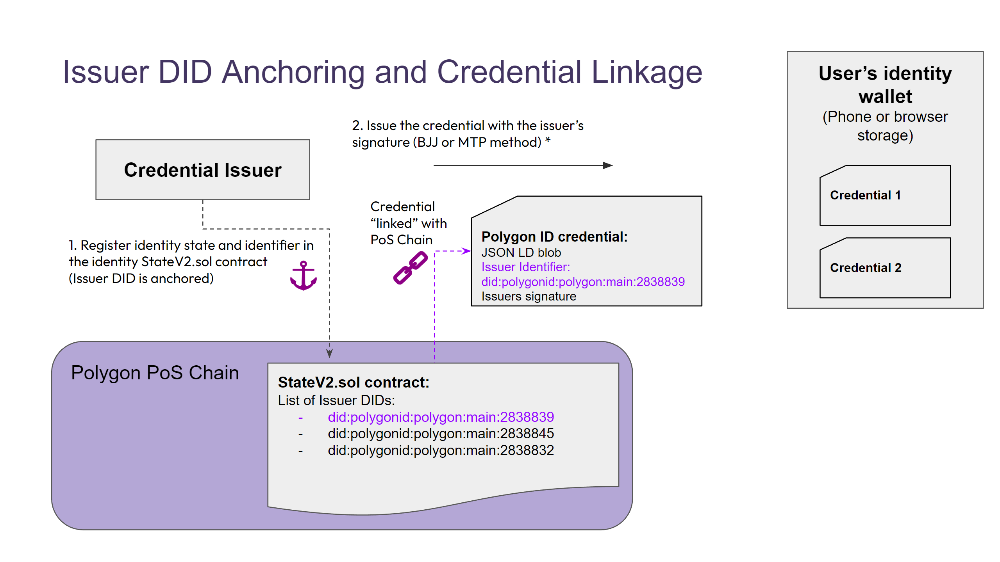
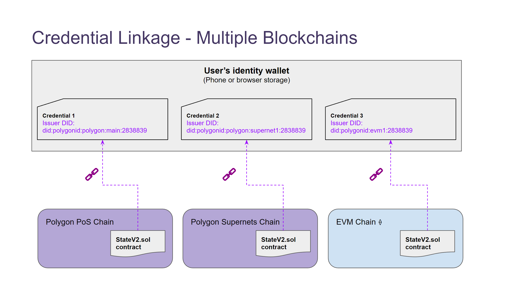

There are 2 types of relationships between credentials and their issuers:

- Issuer DID anchoring: as an issuer of credentials, issuers can choose to just leave their identifier in the genesis state, but it is recommended that they publish their issuer DID on-chain for visibility and traceability purposes. This is done by calling the “Transit State function” so that the issuer can register their identity state and identifier in the identity `StateV2.sol` contract. At this point, we can consider that the **Issuer DID is anchored**.

- Credential Linkage: after the issuer’s DID is anchored to the blockchain, then the issuer can generate credentials with its identifier and signature (using either the BJJ or MTP, see [credential issuance methods](../issuer/cred-issue-methods.md) for more). At this point, we can consider that the credential has a linkage to the blockchain in which the issuer registered its DID. 

!!!note
    If the credential is issued using the MTP method, then the credential data is also “anchored” (via an indirect merkle tree proof) to the blockchain. Otherwise, only the Issuer’s DID is anchored to the blockchain.

## Credential Linkage to Multiple Blockchains

Credentials could be linked to different Ethereum Virtual Machine (EVM) blockchains, they are not limited to only being linked to the Polygon mainnet when they are issued. For instance, credentials could be linked to a Supernets chain or another EVM chain. The issuer state contract could be deployed to other EVM-compatible chains, and verifiers could validate the proofs from these credentials as long as they have access to the particular chain.

