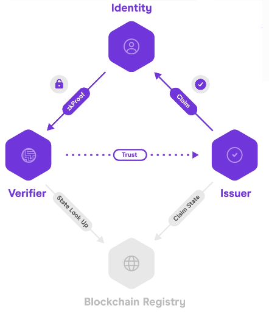

  

<a href="https://twitter.com/0xpolygonid" target="_blank">![Chat on Twitter][ico-twitter]</a>

[ico-twitter]: https://img.shields.io/twitter/url?color=black&label=0xpolygonid&logoColor=black&style=social&url=https%3A%2F%2Ftwitter.com%2F0xpolygonid

[link-twitter]: https://twitter.com/0xpolygonid

---
# Polygon ID: An Introduction

Based on the principles of Self-Sovereign Identity (SSI) and cryptography, Polygon ID is a decentralised and permissionless identity framework for web2 and web3 applications. The SSI framework lets individuals own and control their identities. 

## Why Polygon ID?

Polygon ID, with the help of zero-knowledge proofs, lets users prove their identity without the need of exposing their private information. This ensures both the **Freedom of Expression** to anyone (who intends to use the Polygon ID) and **Privacy by Default** (User's identities are secured by zero-knowledge cryptography).

## Core Concepts of Polygon ID: Claim, Identity Holder, Issuer and Verifier (Triangle of Trust)

Every identity-based information is represented via a [Claim](https://docs.iden3.io/protocol/claims-structure/). In the simplest terms, a claim represents any type of information related to an individual/enterprise/object. The claim could be as simple as the age of the entity or the highest degree held by it. It could be a membership certificate issued by a DAO.

The architecture of the framework is composed of three entities: Identity Holder, Issuer, and Verifier. These three, together, form what we call the `triangle of trust`. Let us see what role each entity plays in Polygon ID. 

1. **Identity Holder**: An entity that holds claims in its [Wallet](./wallet/wallet-overview.md). A claim, as mentioned above, is issued by an Issuer to the Holder. The Identity holder creates the zero-knowledge proofs of the claims issued and presents these proofs to the Verifier (which verifies the correctness and authenticity of the claim). A Holder is also called Prover as it needs to prove to the Verifier that the credential it holds is authentic and matches specific criteria. 

2. [**Issuer**](./issuer/issuer-overview.md): An entity (person, organization, or thing) that issues claims to the Holders. Claims are cryptographically signed by the Issuer. Every claim comes from an Issuer. 

3. [**Verifier**](./verifier/verifier-overview.md): A Verifier verifies the claims presented by a Holder. It requests the Holder to send proof of the claim issued from an Issuer and on receiving the zero-knowledge proofs from the Holder, verifies it. The verification process includes checking the veracity of the signature of the Issuer. The simplest real-world examples of a Verifies can be a recruiter that verifies your educational background or a voting platform that verifies your age. 

> The verification can happen either off-chain or on-chain

 

## Role of Wallet

[Wallet](./wallet/wallet-overview.md) plays a crucial role in the seamless exchange of Verifiable Credentials and other related data with the Issuer, on one hand, and with the Verifier, on the other. As stated above, an Identity Holder carries his/her personal data (including credentials) in the wallet. At the backend, the wallet is able to create identities for an Integrator, fetch and save claims from the Issuer, and create zero-knowledge proofs to be presented to the Verifier. Being the carrier of the sensitive information, Wallet has been designed to ensure that the identity of its Holder is protected and preserved, and no sensitive data can be revealed to the third party without the consent of the Holder.  

## What Can you Achieve Using Polygon ID?

1. **Privacy using Zero-Knowledge Proofs**: An Identity Holder, using zero-knowledge proofs, can keep his/her/its personal data private. During the process of claim verification, it just needs to show that he is the owner of that claim without letting the Verifier know of the actual claim. For example, an Identity Holder can prove to a Verifier authority that s/he is above 18 years of age by presenting the proof that s/he is above 18 without revealing his/her actual age. This ensures minimum data exposure and hence ensures the safety of any sensitive data. 
Another aspect of privacy comes from the fact that the Issuer would not be able to track an individual's credential once it has been issued. 

2. **Off-Chain and On-Chain Verification**: Verification of proofs can be done either off-chain or on-chain via Smart Contracts. For example, developers can set up a contract that airdrops tokens only to users that meet certain criteria based on their claims.

3. **Self-Sovereignty**: Polygon ID renders self-sovereignty in the hands of the user. The user is the only custodian of his/her private keys; user-controlled data can be shared with third parties without taking any permission from the Issuer that has issued the claims to the user. This is possible due to the use of underlying cryptography protocol for verifying data. 

4. **Transitive Trust**: A transitive trust between the players of an SSI system (Holder, Issuer, and Verifier) means that the trust between two entities in one domain or context can be easily extended to other domains or contexts. For instance, the information generated by an Issuer can be conveniently used by more than one Verifier. Along similar lines, an Identity Hodler can build up his/her trust by collecting multiple credentials from different Issuers in one digital wallet. In terms of Polygon ID, this clearly means that data shared will no longer be a thing for competitive moat to be used by centralized authorities.

## Polygon ID and Iden3

<a href="https://iden3.io/" target="_blank">Iden3</a> is the open-source protocol at the basis of Polygon ID. The protocol defines on a low-level how the parties listed above communicate and interact with each other. Polygon ID is an abstraction layer to enable developers to build applications leveraging the Iden3 protocol.

 

## 
<b>[ISSUER - START HERE](./issuer/issuer-overview.md)</b>

## 
<b>[VERIFIER - START HERE](./verifier/verifier-overview.md)</b>

## 
<b>[WALLET - START HERE](./wallet/wallet-overview.md)</b>

---

###### 

<a href="https://github.com/0xPolygonID" target="_blank">Polygon ID on GitHub</a>

