# Create Schemas

The Issuer Node requires schemas to issue Verifiable Credentials. It is a template  that determines the structure of a credential. When a user sends a request to issue a credential, it sends the schema link within the request. 

In this tutorial, we shall see how to create a schema using [Serto Editor](https://schemas.serto.id/editor/). This Editor lets you create, edit, and test the Verifiable Credential Schemas which you can then use to issue credentials. It provides you a UI Editor where you can add different attributes related to a credential and then preview it simultaneously in the JSON format. 

## Steps to Create a Verifiable Credential Schema in Serto Editor

1. Log into the Serto Editor.

2. On the top menu, click **Create**. 

    

   
   

    

3. On the **Create New Schema** screen, enter Credential Schema Name (let's say it is named "golang-fan"), URL Slug, Version of the schema, and its description. 

    

   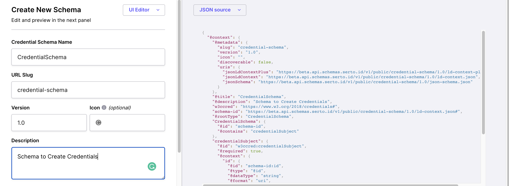
   

    

   

   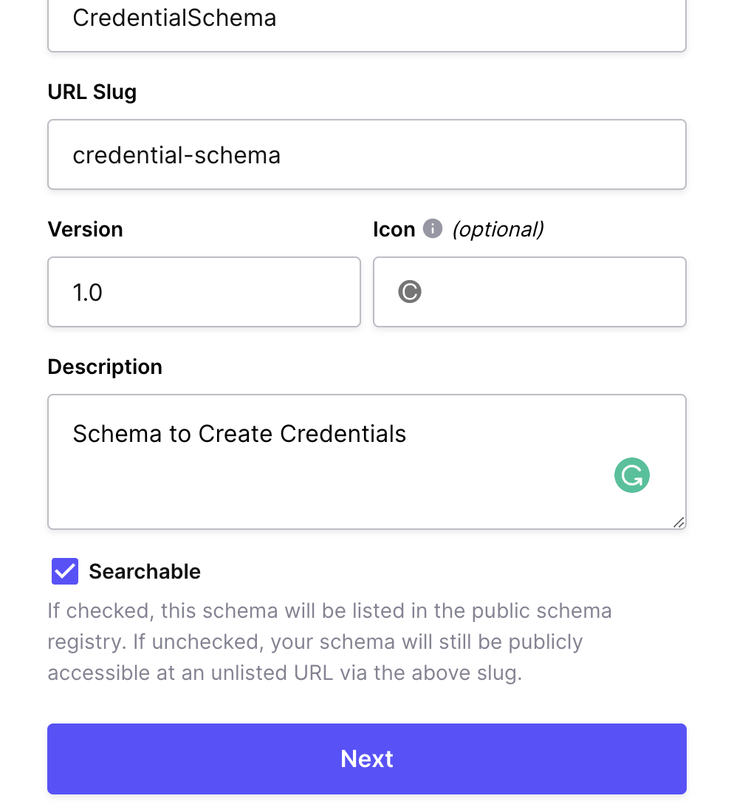
   

    

    > Note: Make sure that you check the  "Searchable" box so that others can find it. 

Click **Next**. 

4. Now that you have defined the general details about schema, it is time to define some schema attributes. This depends on what type of schema you intend to create. For example, if you want to create a age-related schema, you can add attributes like credential id, date of birth, etc. This is just an example; you can define your own set of attributes. 

    

   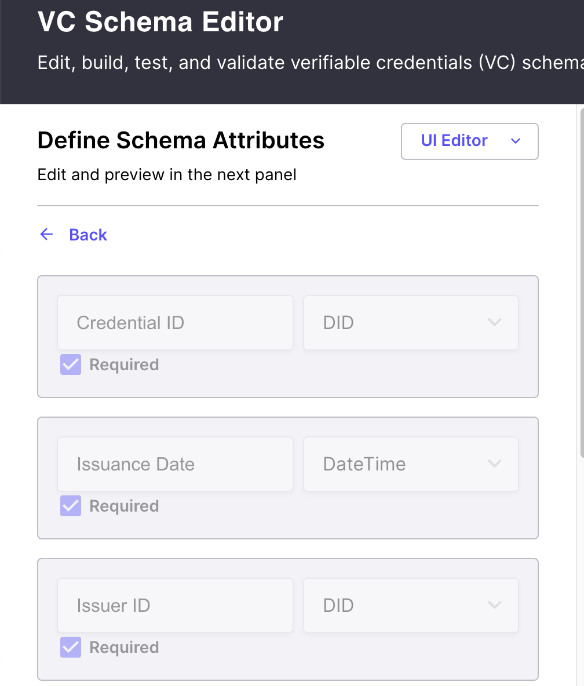
   

    

    

   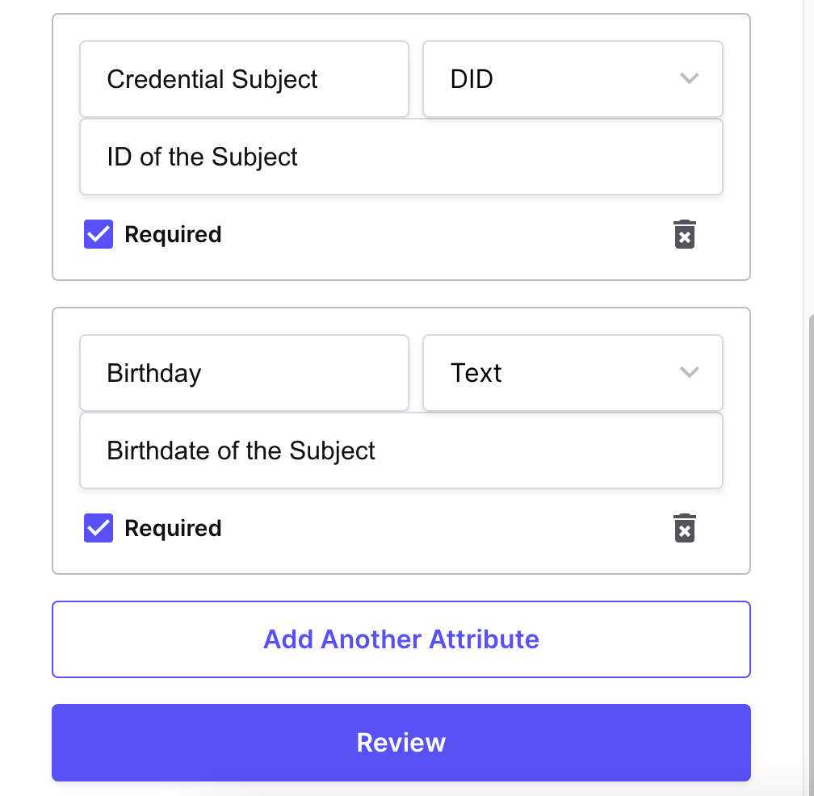
   

    

5. After adding all the attributes, click **Review**. This shows review of your schema:

    

   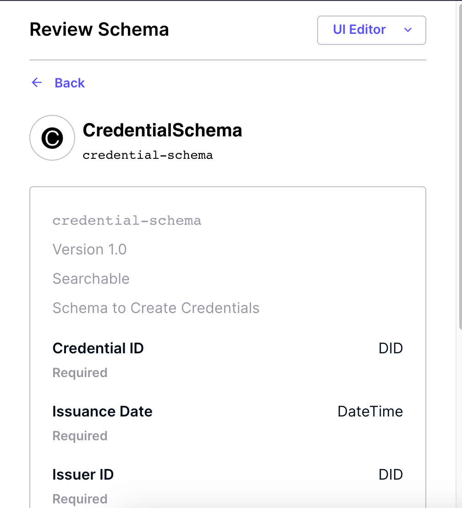
   

    

6. After verifying that all the details you entered are correct, you can now publish your schema. On the UI-Editor, click **Publish**. 

    

   
   

    

**Published Schema**:

   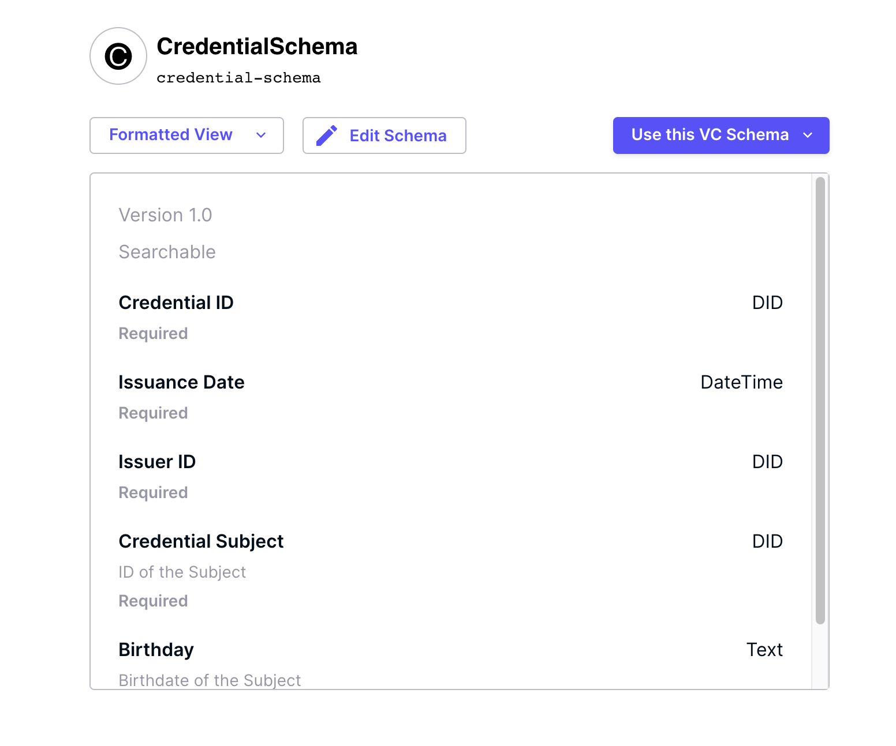
   

    

You can now see your schema in the JSON/JSON-LD formats:

   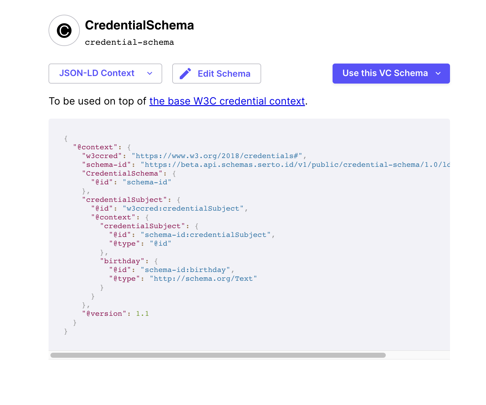
   

    

**Create Credential from Schema Using Issuer Node** 

Once a schema is created, you can use it to issue Verifiable Credential from the Issuer Node.

Follow the steps of [user wallet demo](./demo-user-wallet.md) to create a credential. 

1. Open the **Create Claim** window:

   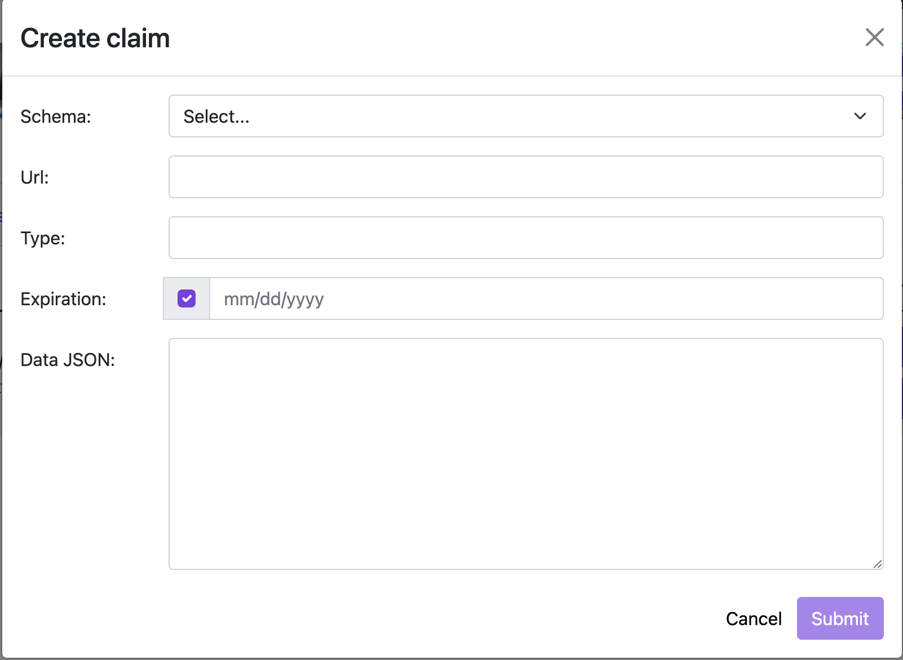
   

 
 and enter the following details:

***Schema***: As you have created your own schema, click the dropdown against `Schema` to select **Custom**.

***URL***: Copy JSON Schema URL from your schema
created on Serto and paste it in the **URL** field. 

   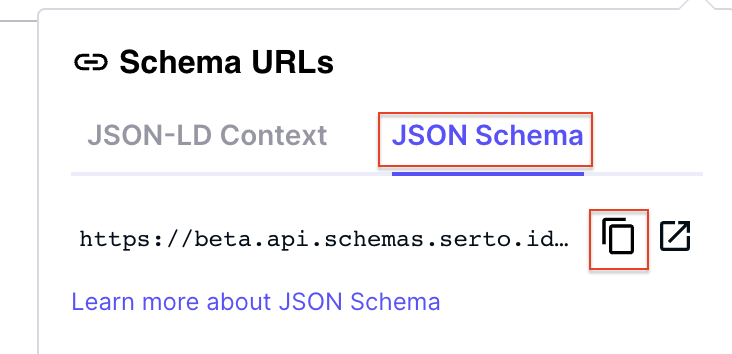
   

***Type***: Copy JSON-LD Context  URL from your schema
created on Serto and paste it in the **Type** field.

   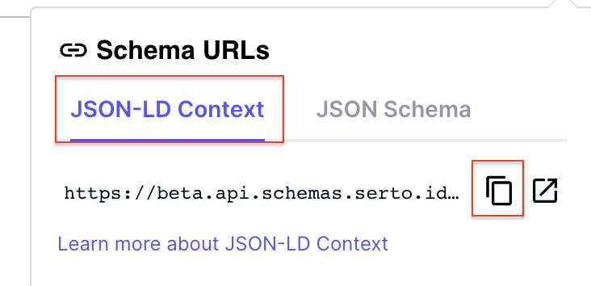
   

***Expiration Date***: Enter date of expiry of the new credential that you are going to create. 

3. Click **Submit**. 

   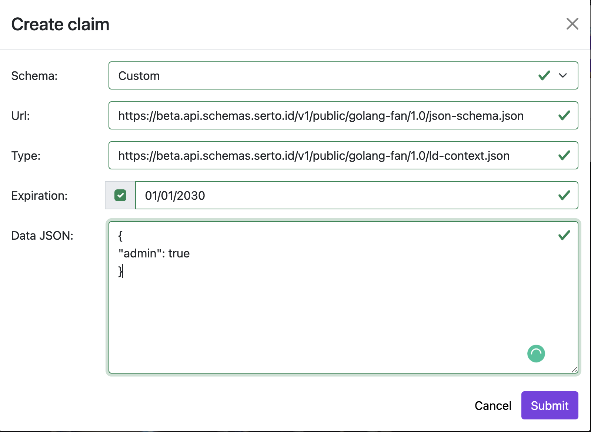
   

This creates a new credential which you can view under Credentail List. Click the icon to view this credential.  

3. Open the 

   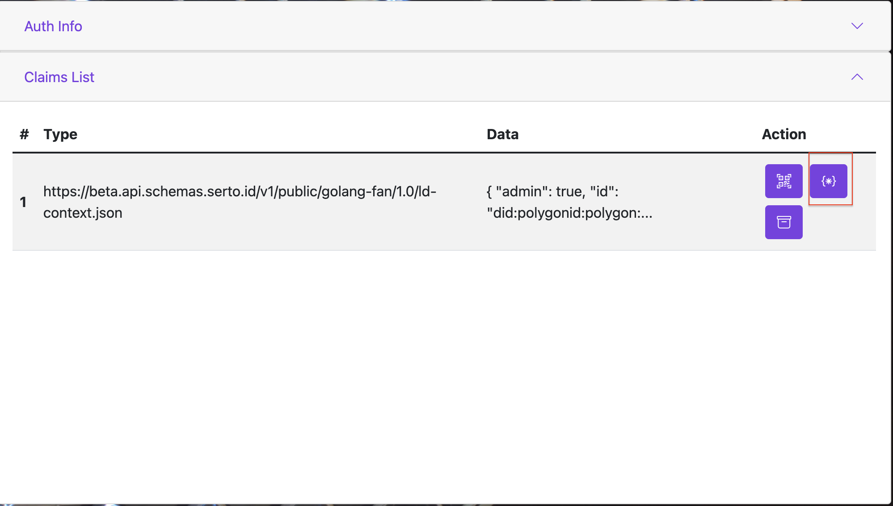
   

 

   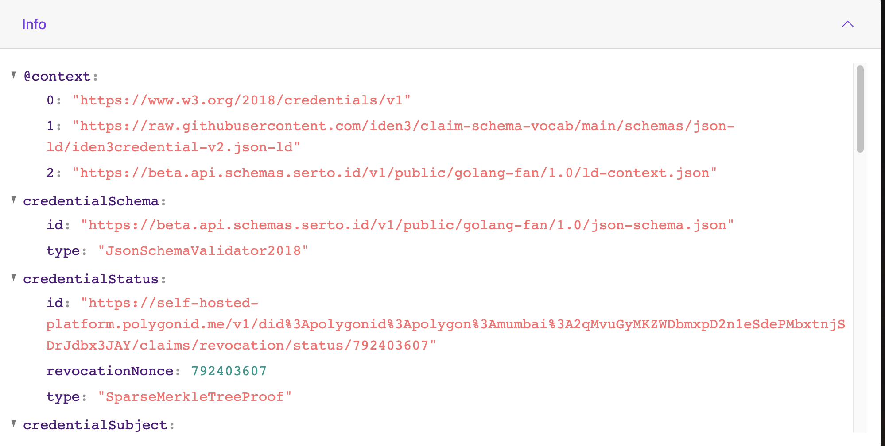
   

 

 

   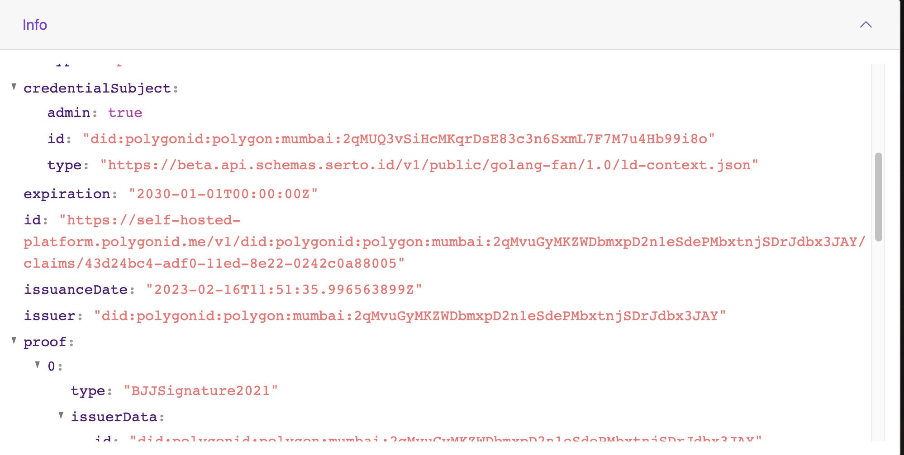
   

