# Demo: Create Credentials using Polygon ID Wallet App

This demo illustrates the process of creating a credential using Polygon ID app and a demo Issuer website. 

To create a credential, you require a schema that contains semantics of the JSON vocabulary and is used to describe a large number of data sets. The schema contains links to JSON-LD Context and JSON URL. For this tutorial, we shall be using an existing KYC-based Age Credential schema.

To create a credential, the Polygon ID app must be installed on your mobile. 

**Steps to Create Credential**

1. On Issuer website, click **Signup**.

    

    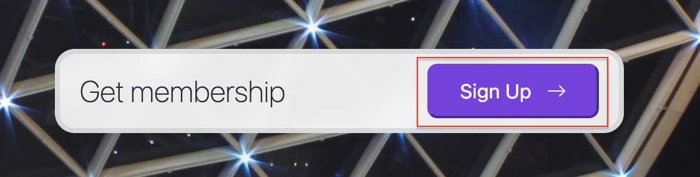
    

     

    It shows the QR code on screen:

    

    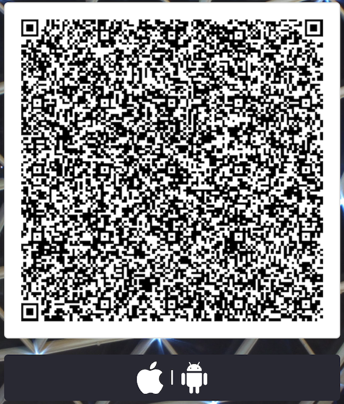
    

     

2. Open Polygon ID app and authenticate with pin/biometrics

    

    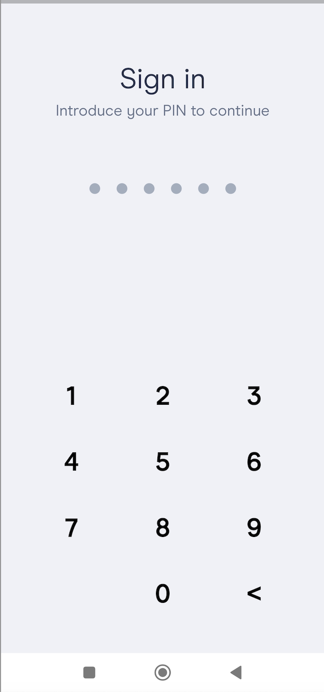
    

     

3. On app, click **Connect**.

    

    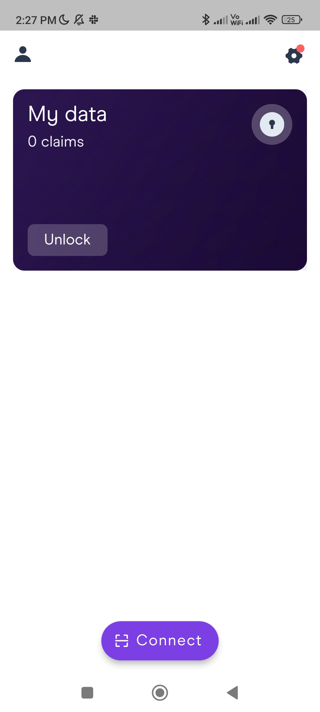
    

     

4. With app, scan the QR code displayed on the site and click **Connect Wallet**. 

    

    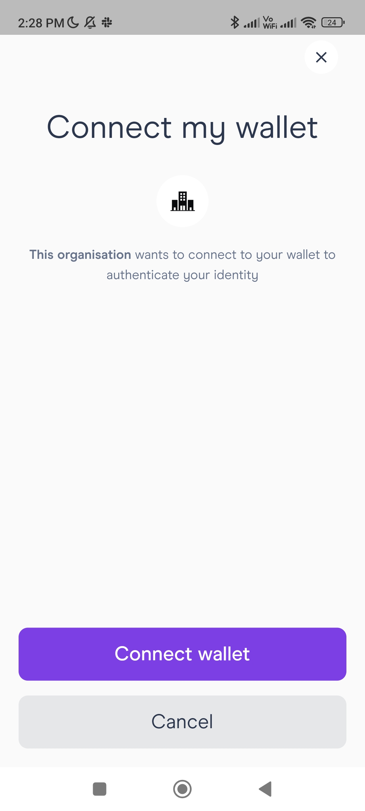
    

     

5. Authenticate again with your pin/biometrics. This starts the authentication of the user's wallet. 

    

    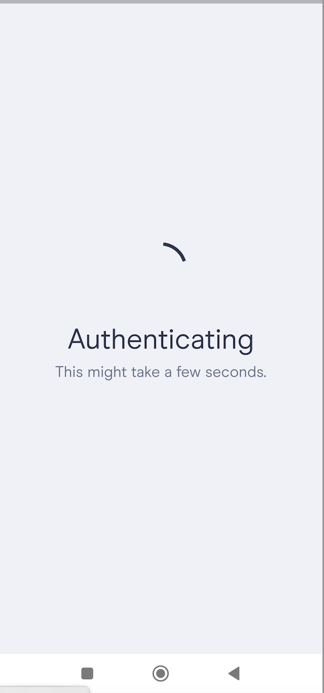
    

     

    After authentication process is complete, the app shows the message if the identity is successfully authenticated or it failed to authenticate.  

    

    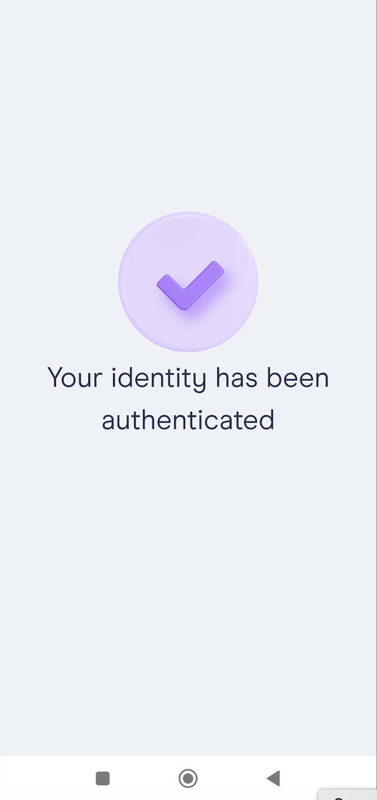
    

     

6. On website, click **Create Claim**.

    

    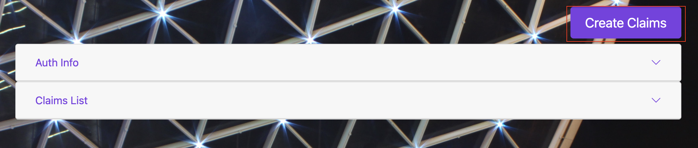
    

     

    This shows the **Create Claim** window:

    

    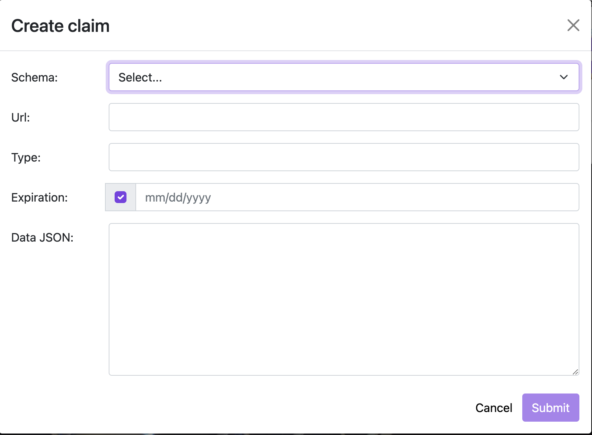
    

     

7. Click the ***Schema*** dropdown menu and select the type of schema you want to use for creating credential. 

    > Note: Please note that in addition to selecting the schemas displayed on the menu, you can also select **Custom** to use your own schema. For this example, we are using KYCAGeCredential type of schema. As you select this, the JSON URL and JSON-LD Context URL are auto-poulated under the ***URL*** and the ***Type*** fields. The ***Expiration*** (date on which credential shall expire) and the ***Data JSON*** are also auto-populated. Click **Submit**

    

    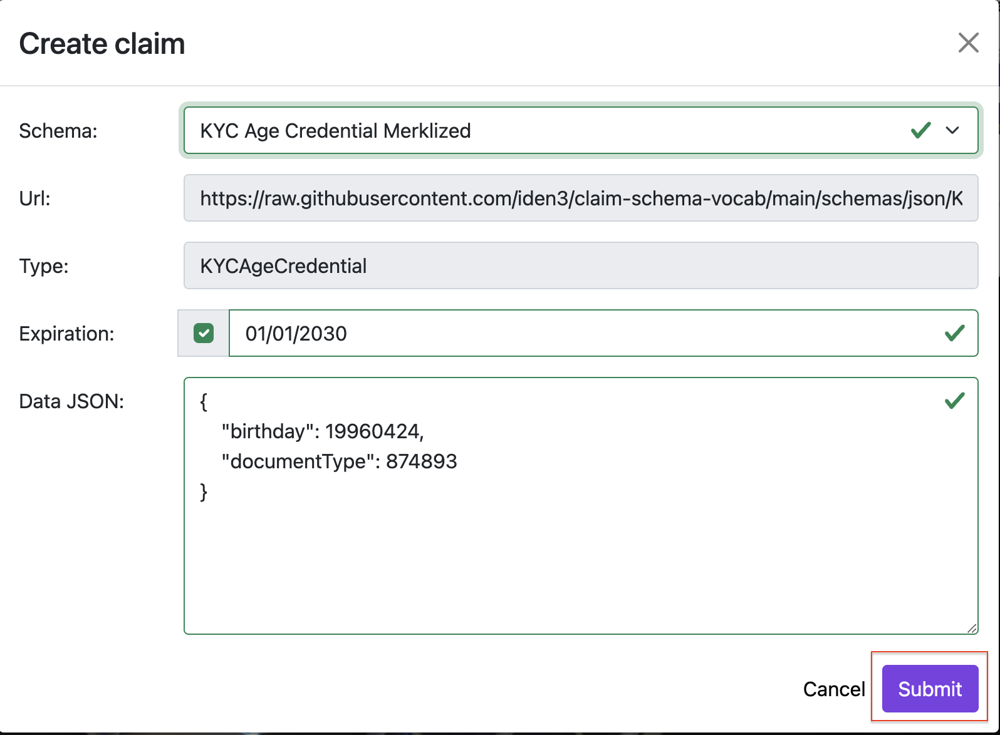
    

     

    This creates a new credential.

    

    
    

     

8. Once a credential is created, you can view it on the Issuer site. For this, click the icon to open and view the credential. 

    

    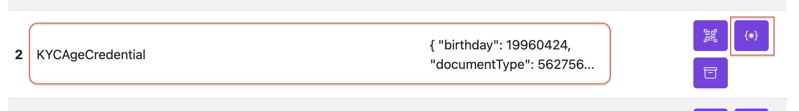
    

     

   A Credential looks like this:

    

    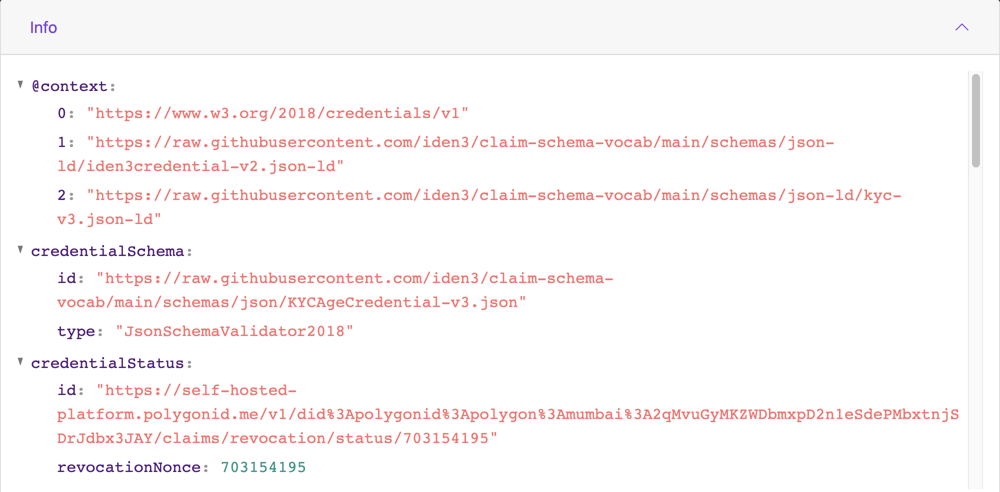
    

    

   

    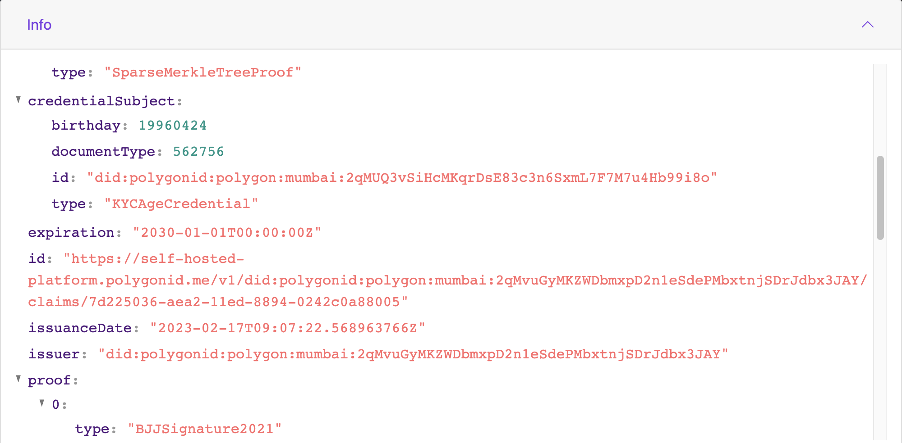
    

    

    

    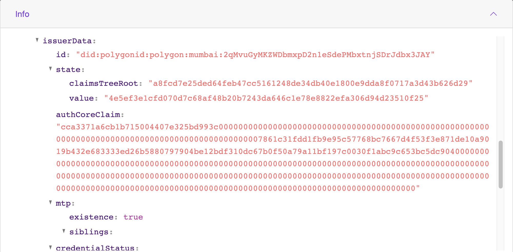
    

    

    

    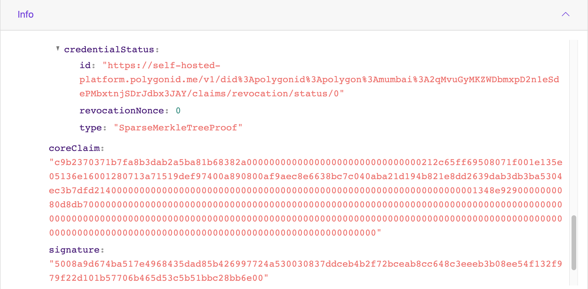
    

     

    This shows all the information related to a credential; this includes:

- @Context (JSON-LD Schema) and CredentialSchema (JSON) URLs
- credentialStatus: Revocation status of the credential along with the revocation nonce. 
- credentialSubject: Infirmation related to the Subject of the Credential. In this example, this includes subject's birthday, documentType, and id of the Subject in the `did` format.
- Other information such as expiration date, issuance date, and id of the Issuer in the `did` format.
- Proof which includes information such as state of the identity published on-chain, the authorization claim, and the actual credential signed by the Issuer.  