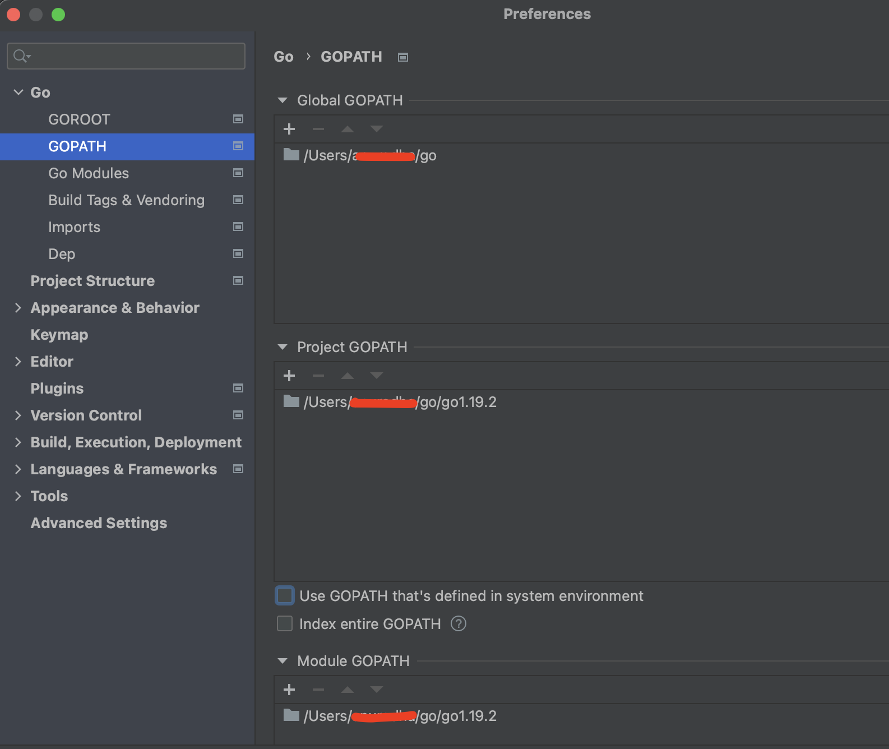

# Configure GoLand IDE

If you intend to start Issuer Node on an IDE, you need to configure it first. Here, we will illustrate how to configure **GoLand IDE**. Steps may vary dependong on the IDE you choose. 

 **Introduction**: GoLand is a Go IDE that lets you build applications using developer tools that are combined to be viewed as a GUI(Graphical User Interface). GoLand lets you write Go code, compile, and debug your code, and install plugins for developing your applications. 

## Set Enviornment Varaibles

### Set GOROOT and GOPATH Variables

GOROOT and GOPATH are the environment varaibles that define where and how the Go source code is stored. 

**GOPATH**: GOPATH is the workspace directory where all the code base and files required for developing a project are stored. By default, this directory is named `go` and is found under the user's home directory. The GOPATh directpry has the following folders in it:

- src:  stores the Go source code
- pkg:  stores the compiled packaged code
- bin:  stores the compiled binaries (executable files)


**GOROOT**: GOROOT defines the location of the Go SDK you install. GOROOT stores the compiler, tools and libraries when you install Go SDK. 

GoLand lets you set your own GOPATH and GOROOT locations. 


## Create a Project in GoLand

1. When you open GoLand IDE, you will see option to create a new project or open an existing one. To create a new project, click **Projects** on the left panel and then click **New Project**. 

    <div align="center">
   
   </div>
   <br>

2. Select the type of project you want to create:  When you create a new project on GoLand, you can: 

- Create a Go Project, i.e. select any location on your local machine to save it.

    OR

- Create a GO(GOPATH) project that lets you save it under the GOPATH's `src` directory (where the Go source code is stored). In fact, you can store all your projects in the `src` directory. 

- Example location of your Go project named `awesomeProject` can be:
    > Users/Username/GoLandProjects/awesomeProject

- Example location of your GO(GOPATH) project named `awesomeProject`can be:
    > Users/Username/go/src/awesomeProject

<div align="center">
   
   </div>
   <br>


 <div align="center">
   
   </div>
   <br>  

3. Set your GOROOT location. As you read in the beginning of this tutorial, GOROOT defines the location of your Go SDK installation. 

    If Go SDK is not pre-installed (shows `NO SDK`) on your machine, you need to install it first. For this, select the **Add SDK** symbol `+` and select **Download** to download the required version of the Go SDK (If you already have the setup stored locally, select **Local** and upload it). If you choose to download, select the correct version of the SDK in the ***Download Go SDK*** box; by default, the system shows the latest version on the top of the list. Enter location for the SDK. The default GOROOT path is: 
    > Users/Username/go

    
    <div align="center">
   
   </div>
   <br>


    <div align="center">
   
   </div>
   <br>

Click **OK**.


4. As both the Project and Go SDK locations have been set, click **Create**. 

   <div align="center">
   
   </div>
   <br>


## Go Modules
Go Modules is a collection all those pacakages (source codes) that are released together. It is a dependency management syatam  for go based projects. A Go Module keeps track of the dependency managment as well as their versioning with a `go.mod` file at its root. A `go.mod` file  defines the path of the Module and all the dependency (other modules) requirements. A typical `go.mod` file looks like:
```
module module path

go version

require (
	module1 path semantic version of module 1  (dependency 1)
    module2 path semantic version of module 2  (dependency 2)
)
```

where module 1 and module 2 are the dependencies for the main module.

Example:
```
module github.com/user/project 

go 1.14

require (
	github.com/abc/xyz v1.0.1
	github.com/pqr/stv v0.20.1-beta
)
```
Earlier, it was required for all the projects to be in the GOPATH/src directory and all the project dependencies were downloaded to GOPATH/src. But with Go Modules acting as a dependency manager witha go.mod file in it, we can intialize our project anywhere and there is no need to keep it under GOPATH. In such a case, all the dependencies are downloaded in the GOPATH/pkg/mod with the versioning coming into picture. Doing so keeps the project files separated from the GO source code.


### Enable Go Modules in a Project

1. On the ***GoLand*** menu, click **Preferences**. 

 <div align="center">
   
   </div>
   <br>

2. Click the ***Go*** menu and then click **Go Modules**. Select the **Enable Go Modules Integration** check box. 

 <div align="center">
   
   </div>
   <br>

3. Click **Ok**. 

### View Go Modules of your Project

The Go Modules are located under the **External Libraries** folder in your project directory. To view the Go Modules:

1. In the ***View*** menu on Goland, click **Tool Windows** and then select **Prpject**. This displays your project directory. 

2. Under ***Project***, click **External Libraries** directory. Here, you can view all the Go Modules for your project. 

<div align="center">
   
   </div>
   <br>


<div align="center">
   
   </div>
   <br>


## Syncronize Dependencies from Go File


### Configure GOPATH for Different Scopes

GoLand lets you set your GOPATH for three different scopes:

- Global GOPATH: The global scope lets you configure a GOPATH  for all the projects on your GoLand IDE. Set it only once and it will be applicable for all teh projects. 

- Project GOPATH: The project scope lets you configure GOPATH only for your current project on IDE. This indiactes that one project can have different GOPATH while the other one can have an entirely different one.

- Module GOPATH: The module GOPATh is set for one module.

If you configure GOPATh for all the three scopes mentioned above, the system will consider the narrowest one, i.e. the Module GOPATH. 

To set the GOPATH for these scopes:

1. On the ***GoLand*** menu, click **Preferences**. 

2. Click the ***Go*** menu and then click **GoPATH**.

Under Global GOPATH, click the `+` symbol to add the path. Select path on your system. Similarly, you can set paths  under `project` and `module` scopes. 


<div align="center">
   
   </div>
   <br>

As mentioned above, if you set both Global and Project scopes, the system will consider the narrowest one, i.e. the path set for project scope. If you set all three, the system will secelect the narrowest fo all three, i.e. path set for module scope.