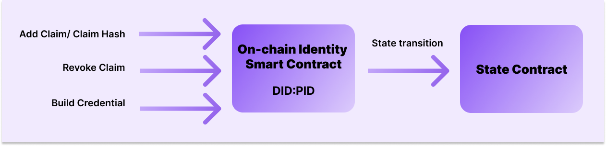

The On-chain Issuer is a way of issuing credentials by leveraging the full power of a smart contract. As it is commonly known, a smart contract is software that resides in a blockchain network, meaning that its code and data aren’t necessarily stored in a server, but rather it is distributed in a decentralized manner. Therefore, an on-chain issuer could be considered a decentralized issuer, as all the underlying logic of the credentials is written on a smart contract with its inherent publicity. 

This issuance method then serves as an alternative to the [Issuer Node](https://0xpolygonid.github.io/tutorials/issuer/issuer-overview/), whose implementation depends on a dedicated setup and its own infrastructure. 

The fact that all this logic is present on the blockchain enables credential issuance for DAOs in a programmatic way. It can also be useful for entities like oracles and on-chain analytics companies since the contract code can be audited and verified. 

## On-chain issuance
On-chain issuance is trustless or trust-minimized, depending on smart contract business logic. It reduces dependency on non-auditable decisions for issuing credentials.
The properties of smart contracts make them good candidates to act as trusted attestation services since the attestation mechanism is transparent and auditable to everyone. This serves as an alternative to a number of centralized issuers for use cases when an Identity needs to issue credentials about themselves or their activity, which can be verified by the smart contract logic.

In simple words, you can see everything happening, all the logic used to generate the credential is live on the blockchain and ready to be checked and verified.

!!!info
        An On-chain Issuer, in fact, is a special case of the On-chain Identity. You can find more information about it on the [Iden3 documentation](https://docs.iden3.io/getting-started/identity/onchain-identity/).

## Smart contracts
Smart contracts generate and manage identities. They can also manage Merkle Trees on-chain. 
Each issuer has its own identity contract. Each contract, which is linked to an identity, will have its own custom verification logic:  what they are issuing and to whom. 

There are still the possibilities of either using one smart contract with a set of different business logic for specific credentials or having one smart contract for each use case.

Some of the methods that can be performed by the SC:

- Add claim / claim hash
- Revoke claim
- Build credential

There is a set of features to be implemented in Solidity and provided to developers, protocols or dApps. You would have to integrate it as a library or as a standalone contract, thus controlling the identity of your users.
## Possible use cases
There are many possible use cases enabled by an on-chain issuer. One of them is the possibility of the ID holder using an application to check their own data validity and send a zero-knowledge proof to an on-chain issuer, which will be responsible for generating a verifiable credential. 

Another way of using the on-chain issuer is gathering available data on-chain for a particular identity and producing a verifiable credential from it.
In fact, on-chain issuers enable two categories of credentials: public and private ones. 
### Public use cases
A public credential will leverage all the available data of a particular address and aggregate it to generate a claim, such as a reputation score, linked to an identity - there is no personal information revealed and it can be made available on-chain.

In this case, the value is in the aggregation of large amounts of information into ready-to-use credentials that are linked to an identity. This way, the identity holder could prove his assets without disclosing the Ethereum accounts that control these assets.

Some interesting examples of public use cases would be: 

- An oracle that summarizes the on-chain activity of one account could issue a credential to an identity holder that proves control of that address. Then, the identity holder could present a zero-knowledge proof of that credential to operate on DAOs, DEFI, etc.
- Signing a transaction to a smart contract could trigger the creation of a credential attesting to the ownership of a crypto address by a DID holder.
### Private use cases
On the other hand, private credentials usually stem from privately-held data that are used for self-attestation, meaning that the ID holder is able to create a credential himself with his data and share zero-knowledge proofs of its validity.

When the information used to generate the credential contains personal data that shouldn’t be on-chain, the zk-circuit is used to verify that the credentials were built correctly. In this case, the credential is generated off-chain by the end user in a way that it includes some cryptographic proofs of validity: 

After generating the credential and using a contract-specific circuit, the application that generated the credential could send a zero-knowledge proof of “Validity of Credential” to the on-chain issuer smart contract. Then, what the Smart Contract would verify is that there is a Verifiable Credential that was built following a certain process (that includes the cryptographical proof of validity, such as government public keys).

In this scenario, the value is in allowing end users to leverage existing cryptographic proofs of different types that they have available (government keys, JWT tokens in Web2 accounts etc) to self-issue credentials that they can add to their identities.

Some interesting examples of private use cases would be: 

- User performs a self-attestation of their identity backed by the government public signature. Circuits running privately on a user's mobile phone could verify the input of an NFC chip, build credential and then send the transaction to a smart contract, which will be able to verify proof and issue (by adding its hash to claims merkle tree) a credential from it.
- Using JWT claims from Web2 applications through a browser extension - i.e. creating a credential with a date of birth and address from a company store.
