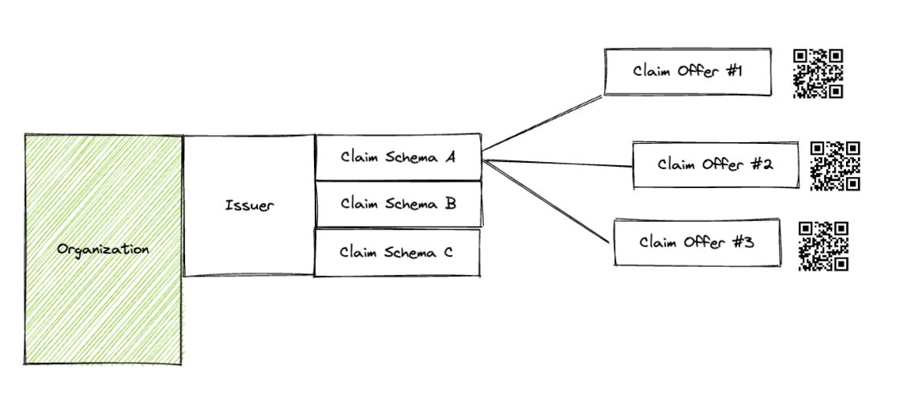
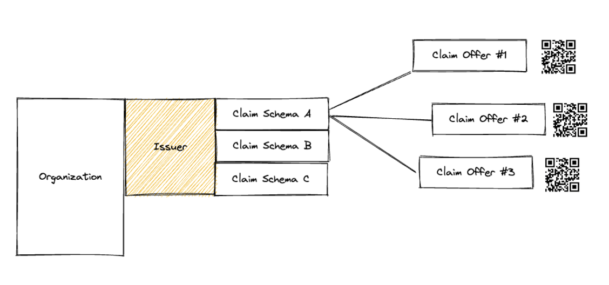
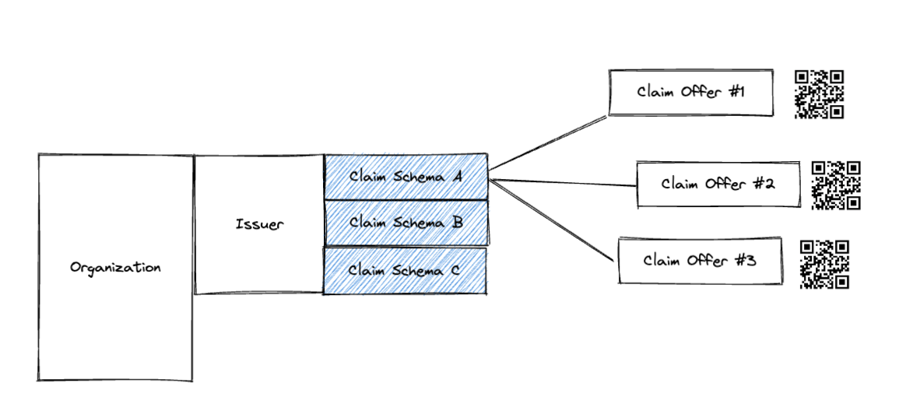
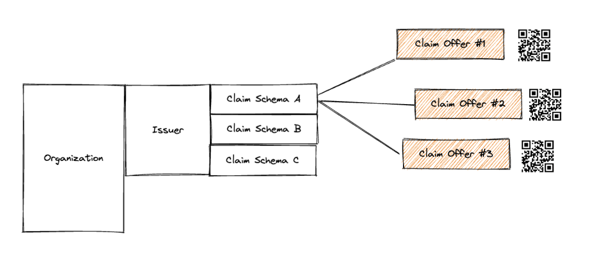

# Tutorial - Issuer Integration Full Flow

This tutorial will walk you through a Full Flow Issuer Integration using Polygon ID APIs. By the end of Tutorial you will have set up an Issuer and offered a Claim to your users. 

The tutorial is made of 4 steps: 

1. Onboard your Organization to Polygon ID
2. Set up an Issuer 
3. Create a Schema 
4. Generate a Claim Offer (and a QR Code) so that user can fetch it inside their Wallet 

## 1. Onboard your Organization

The first mandatory thing is to create an account for your Organization using email and password, execute the login and activate the account. Every action performed within Polygon ID APIs requires to be owner of an Organization Account by providing a Bearer Token.

 

=> Orgs/Create  

You only need to perform this action once. 

=> Org/Login 

The credential used to create your Organization Account will be then used to [Sign-in](#sign-in).This action has to be performed to obtain a Bearer Token. The Response Body contains a JWT token that will be used as `Bearer Token` in order to use other Endpoints

=> Org/Activate

To use this Endpoint you need to already have [Signed-in to your Organization Account](#sign-in). It is mandatory to activate an Organization Account. This action has to be performed only once and can also be executed using the link sent to your Organization Account email after the first sign-in.

An owner of an Organization Account has percan set up an [Issuer](../issuer/apis.md) and will soon be able to set up a Verifier.  It is mandatory to create an Organization Account in order to perform any further action such as Creating Schemas or Issuing Claims. It updates the `Bearer Token`

=> Org/Refresh 

R: Because when you create an Issuer, your account management should refresh the token in order to get the organization id.

## 2. Setup an Issuer

Before start Issuing Claims, it is necessary to setup an Issuer. To setup an issuer it is required to have an Organization Account signed-in. Each Organization Account can only manage a single Issuer. This Endpoint requires to pass an active `Bearer Token` that can be retrieved after [sign-in](../onboarding-orgs/apis.md#sign-in) to your Organization Account

> Today an Organization can only set up 1 Issuer. Soon more actions will be enabled for an Organization such as setting up multiple Issuers or a Verifier.

 

=> Issuer/Create  

## 3. Create a Schema

Before issuing the actual Claim, it is necessary to define an Schema, that is, the structure of a particular claim that defines the usage and the vocabulary of its Attributes. In order to create a Schema, it is necessary to have an Issuer setup. An issuer can create as many Schemas he/she wants!

Let's consider the example of a company that wants to issue Claims to its employees attesting the starting data and their monthly salary. In this case, the company will create a schema defined `EmployeeData` with two attributes:
- `EmployedSince` that accepts a `date` format 
- `MonthlySalary` that accepts a `number` format

- Ideally this action should be performed only as many times as many claim schemas you want to provide to your users

 

=> Schema/Create  

In order to start offering Claims to your users is necessary to have an existing Claim Schema to fill. Once a new Claim Schema is created it can be referred to use by its `id`. 

## 4. Generate a Claim Offer

The only thing missing to fill up the Claim Schema with actual user data and present it to users: this is what the Claim Offer does!. A Claim Offer must be based on an existing Claim Schema. The Claim Offer consists in a QR Code that gets scanned by the user in order to fetch that specific Claim to their wallet. Each Claim Offer corresponds to an interaction with a single user (explain that in the example).

- Example of integration: You make some sort of check inside your platform and then start issuing claim based on that
=> Specify the strategy needed to extract the QR and display the offer to your user! 

 

=> Offers/Create
=> Offers/Create QR Code

The generated QR Code is mandatory for an Issuer to initiate a communication with the users. When scanning the QR Code with their Wallet, a user will be asked to authenticate. In order to fetch the actual claim associated with the Claim Offer, the user needs to scan a second QR Code generated as response to the [Get QRCode of Offer](#get-qrcode-of-offer) Endpoint. As each QR Code contains a specific session ID, it is necessary to create a QRCode for each user that you are offering a Claim to. 

=> Offers/Get QR Code of Offer

The generated QR Code is mandatory for an Issuer in order to let users fetch claims inside their Wallet. When scanning the QR Code with their Wallet, a user will be asked if he/she wants to accept the Claim Offer. On acceptance, they will see a new claim added inside their Wallet. Since the generated QR Code is associated with the sessionID of the user that got previously authenticated, it is necessary that the user scanning the second QR is the same that performed the authentication in the first place, otherwise he/she won't be able to fetch the claim inside their wallet.
