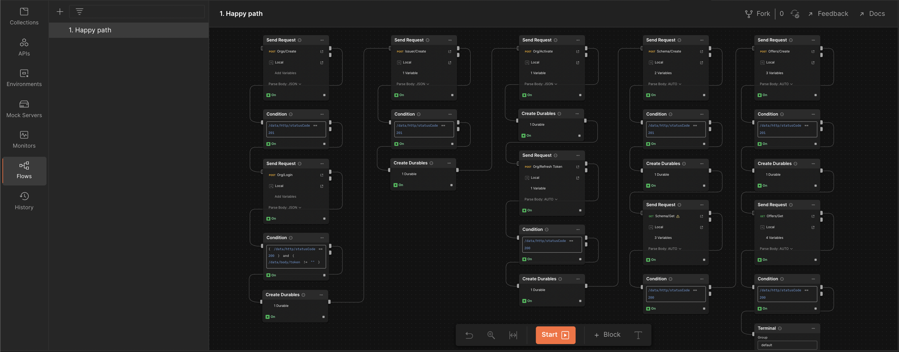

# Tutorial - Issue Claim Flow

**Describe an example of integration using PID Platform APIs to issue claims and offer it to your users**

- Specify that this action will be performed many times as many are the claims that you are gonna issue
- Specify that this action requires an organization and an existing claim schema (either issued by you or by someone else)
- Example of integration: You make some sort of check inside your platform and then start issuing claim based on that
=> Specify the strategy needed to extract the QR and display the offer to your user! 

