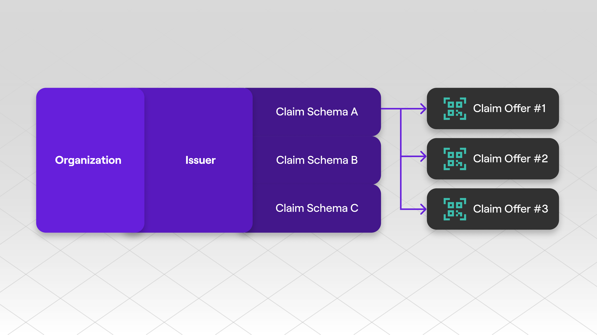

# Polygon ID Platform API

The Polygon ID Platform API exposes all the functionalites necessary to run a issuer.

The core functionality of the Platform API are:

- [Onboarding Orgs](./onboarding-orgs/apis.md) to register and manage an Organization Account
- [Issuer](./issuer/apis.md) to set up an Issuer
- [Schemas](./schemas/apis.md) to create and manage Claim Schemas
- [Claim Offers](./offers/apis.md) to issue Claims based on existing schemas and offer it to your users via a QR code

 

The APIs categories have to be considered as sequential steps: you cannot start creating schema and issuing claims without having a Issuer. Similarly you need an Organization account in order to create an Issuer on Polygon ID Platform. 

In order to start playing around with the Platform APIs complete the [Issuer Integration Full Flow Tutorial](./flow-tutorial/happy-path.md)