## Demo for Polygon ID JS SDK Browser Wallet Extension

Polygon ID has created a browser wallet extension based on JS SDK that lets its user fetch credentials from an Issuer and generates proof for these credentials to be presented to a Verifier. 

You need to install the browser wallet extension on your machine. This wallet works like a common crypto wallet such as MetaMask Wallet but differs in functionality. 

## Demo for JS SDK Browser Extension Wallet

1. Install the Polygon ID JS SDK browser wallet extension on your machine and open it. 

2. When you open the extension for the first time, it prompts you to create a new wallet or import an existing wallet. Click **Create a New Wallet**. 

    

    
    

     

3. This shows the ***Create Password*** screen. Enter your password and confirm it. Click **Create**. 

    

        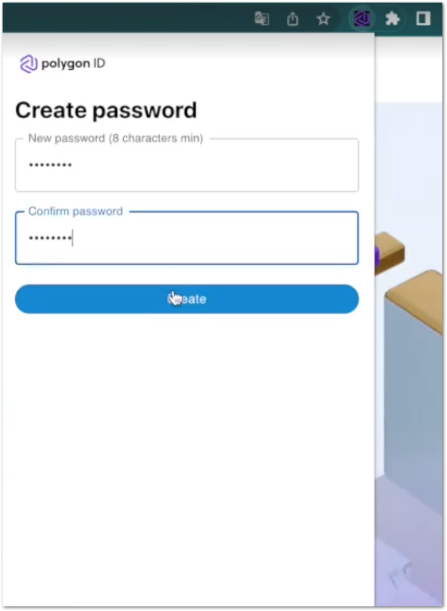
    

4. This displays the Polygon Account window on your browser wallet. 

    

    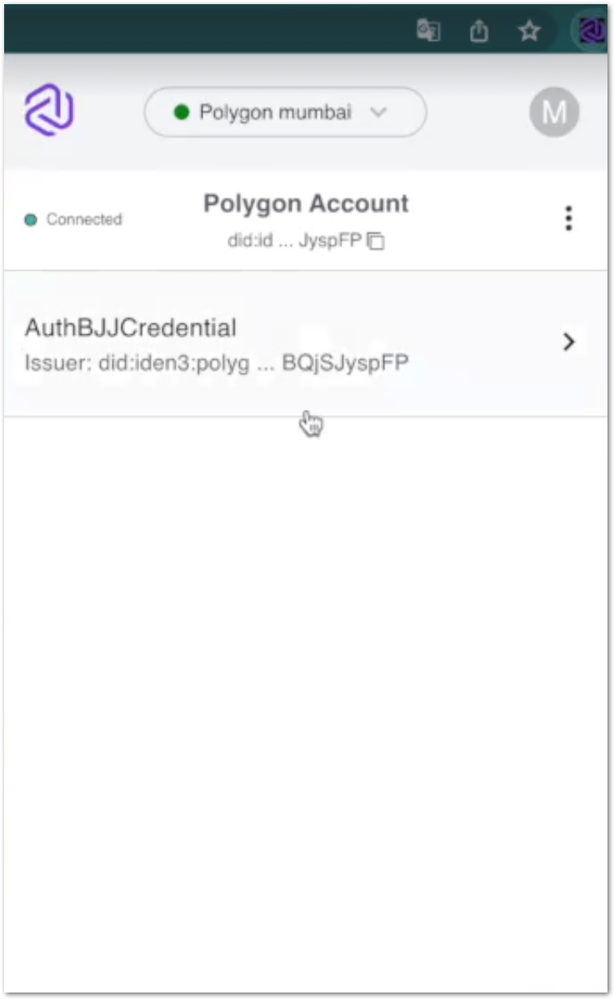
    

     

5. Open the Polygon Verify website (this is like an Issuer site that issues credentials to its users). Click **Sign Up**. 

    

    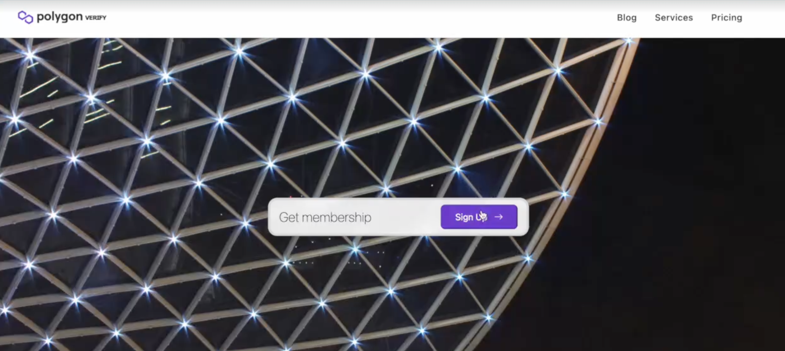
    

     

6. A QR Code is displayed. Click ***Polygon ID*** icon to open your browser wallet.

    

    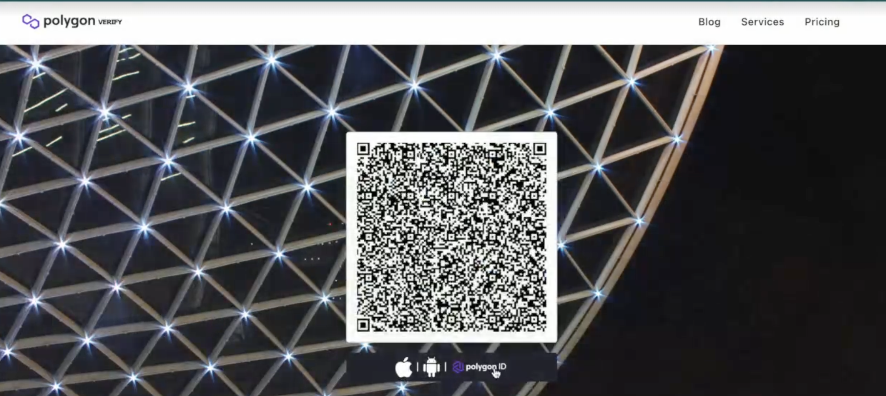
    

     

7. Your wallet shows the ***Authorization*** window. Click **Approve**. 

    

    
    

     

    This shows auth info and claims list on the Polygon Verify site. 

    

    
    

   

## Steps to Create and Fetch Credentials

1. On the website, click **Create Claim**. 

    

    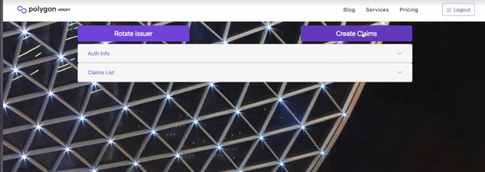
    

     
2. This displays the screen to create claims.

    

    
    

     
3. Select **Schema** using which you need to create credentials. Enter **Schema URL**, type of credential required, date of expiration of the credential, and other information related to the credential. (For example for a KYCAgeCredential, we can enter **birthdate** and **DocumentType**). Click **Submit**. 

    

    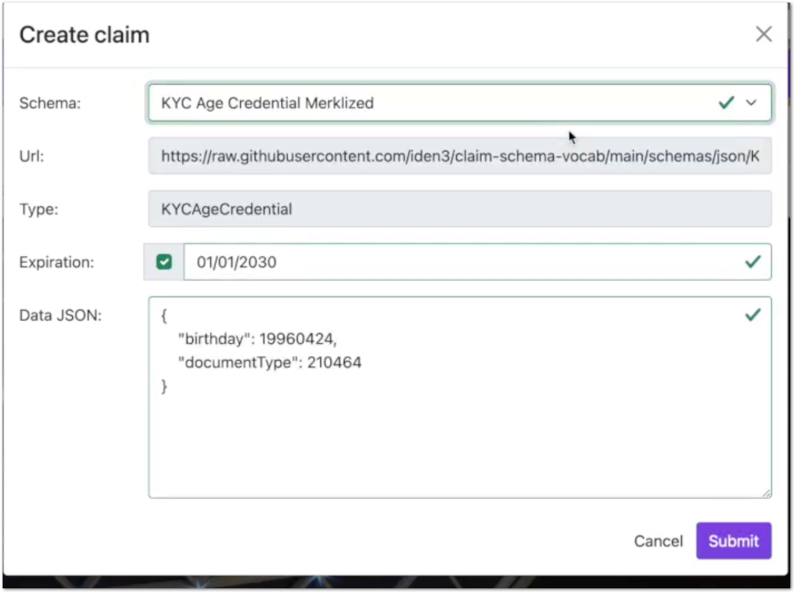
    

     
4. The site shows the publishing screen.

    

    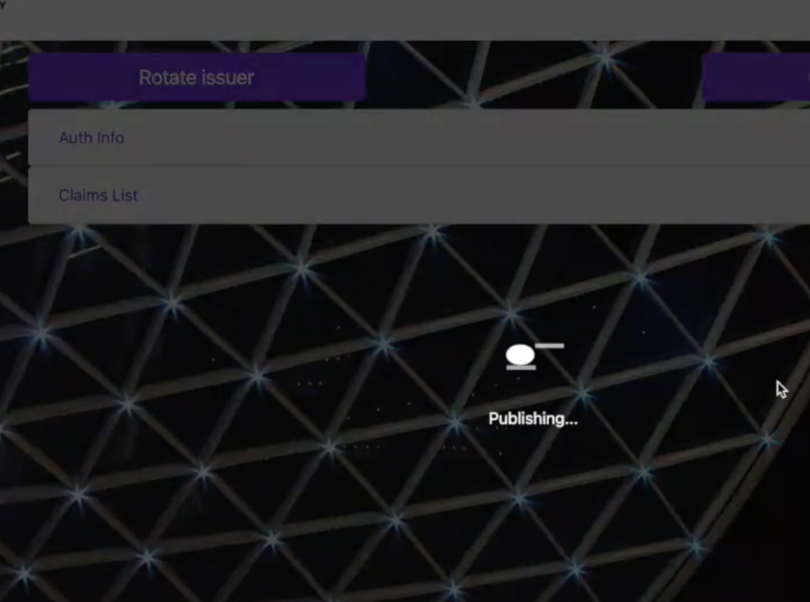
    

     
    The credential is created successfully. 

    

    
    

     
5. As the credential is now created, the user needs to fetch it to his/her browser wallet. The website displays the QR code. Click the ***Polygon ID*** icon to open your browser wallet. On the wallet, click **Receive**.

    

    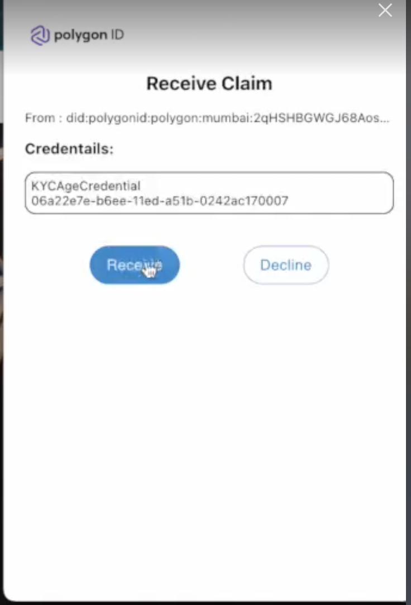
    

    The credential is now saved on your browser wallet.

    

    
    

## Steps to Create KYCAgeCredential Signature Proof

1. On Polygon Verify website, select the ***KYCAgeCredential(less than 2000/01/01)- sig*** type of credential. 

    

    
    

2. Click **Sign In**. This shows the QR code for the credential type you selected in the step above. Click the ***Polygon ID*** icon to open your browser wallet.

    

    
    

     
3. The browser wallet shows the ***Proof Request*** window. Here, you can see the type of credential and proof requested. As you have selected the credential based on signature proof, the ***Proof Type*** shown here is of the type ***credentialAtomicQuerySigV2***. Click **Continue**.

    

    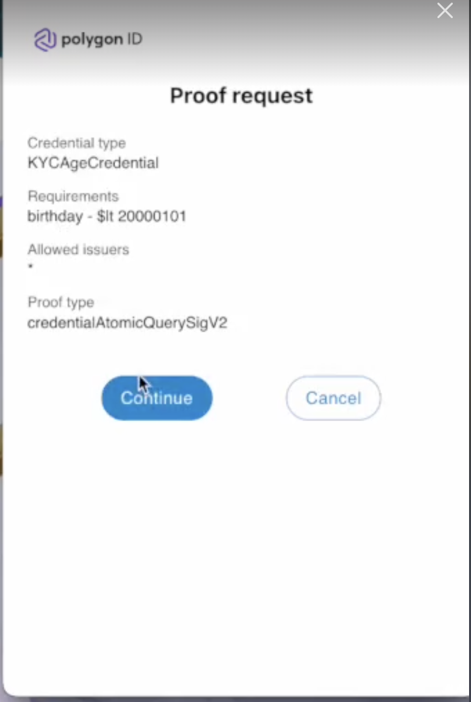
    

4. The website verifies your membership successfully.

    

    
    

5. On wallet, click **KYCAgeCredential** to view its details including ***birthday***, ***documentType***, ***Issuer*** (DID of Issuer), ***Issued On*** (Date of Issuance), ***Expiration Date***, and ***Proof types*** (in this case, it is BJJSignature2021)

    

    
    

     
6. On the Polygon Verify website, click **Auth Info** to view details of the ***Auth Request*** (authorization requested by the user). 

    

    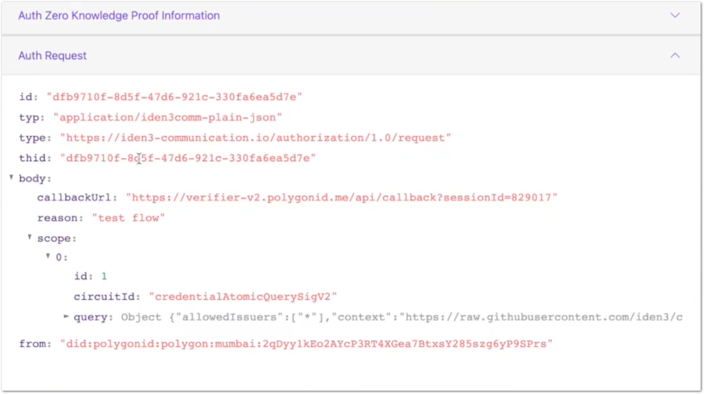
    

     
    Scroll down the page to view ***Auth Response***. here, you can see the proof and the public signals (used to generate the proof), and the JWZ token. Copy the JWZ token and paste it on the [Polygon ID JWZ Validator](https://jwz.polygonid.me) site. Click **Validate**. 
     

    

    
    

     

    Upon validation, the JWZ token is broken down into three parts: ***Header***, ***Payload***, and ***Auth Proof***.  

    

    
    

     

    

    
    

     

    

    
    

      

    

    
    

     

    You can see proof along with other data including ***from*** and ***to*** fields. The ***from***  field stands for DID that sent the proof request. It must match your wallet's DID. The ***to*** stands for the Verifier DID to whom the proof request has been sent. 

7. Wait for the proof to get published on-chain. Post that, on the website, you can view the credential details that show ***state*** information such as ***txId*** (id of the transaction done from a wallet to complete publishing of the state on-chain), ***blockTimestamp*** (time at which block was created), ***blockNumber***, ***rootofRoots*** (Roots tree), ***claimsTreeRoot*** (Claims tree), ***revocationTreeRoot***(Revocation tree): 

    

    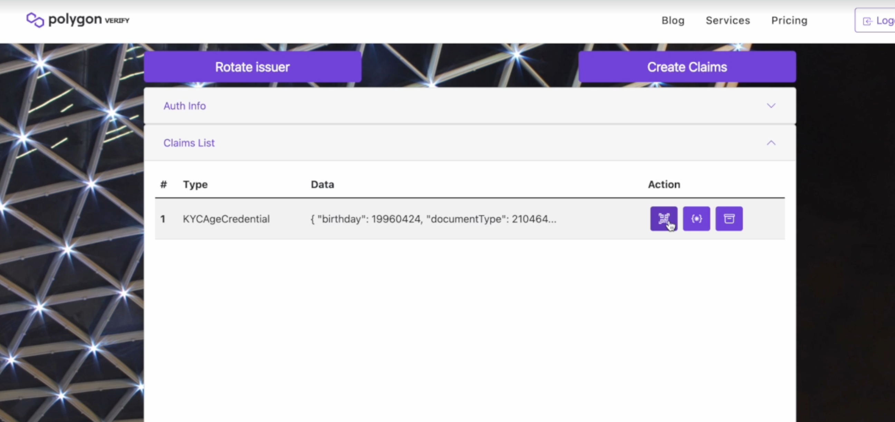
    

    

    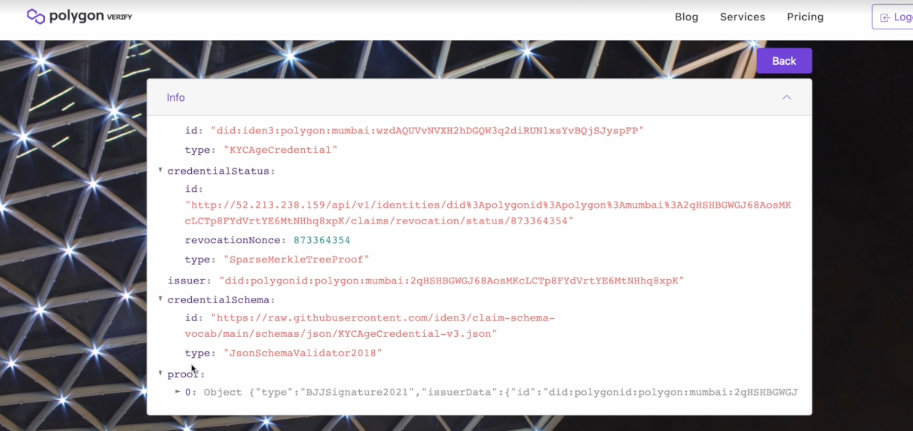
    

    

    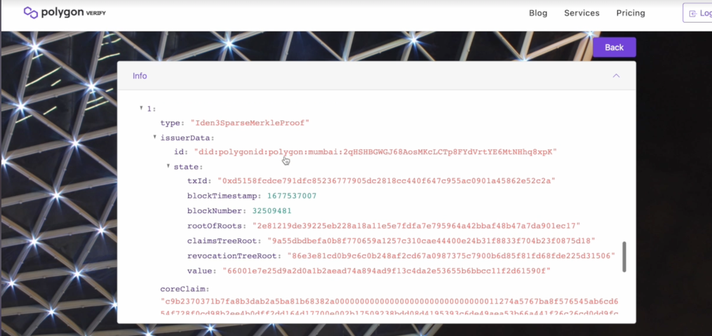
    

     

8. Below the QR code, click the ***Polygon ID*** icon to open your browser wallet. On your wallet, click **Receive** to fetch and save the credential to your wallet. 

    

    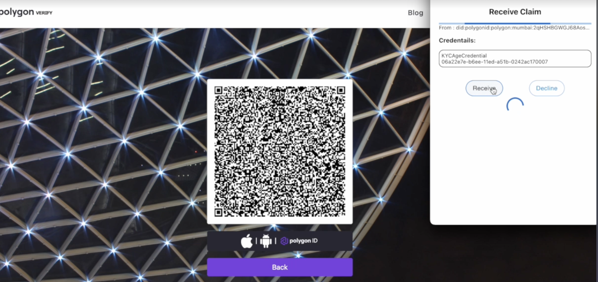
    

     

    Click your KYCAgeCredential to view its details. You can now see that you have two types of proofs in your wallet: ***BJJSignature2021*** and ***iden3SparseMerkleTreeProof*** 

    

    
    

     

## Steps to Create KYCAgeCredential Merkle Tree Proof

1. On the Polygon Verify website, select the ***KYCAgeCredential(less than 2000/01/01)- mtp*** type of credential. 
    

    
    

     

2. Click **Sign In**. This shows the QR code for the credential type you selected in the step above. Click the ***Polygon ID*** icon to open your browser wallet.

    

    
    

     

3. The browser wallet shows the ***Proof Request*** window. Here, you can see the type of credential and proof requested. As you have selected the credential based on MTP proof, the ***Proof Type*** shown here is ***credentialAtomicQueryMTPV2***. Click **Continue**.

    

    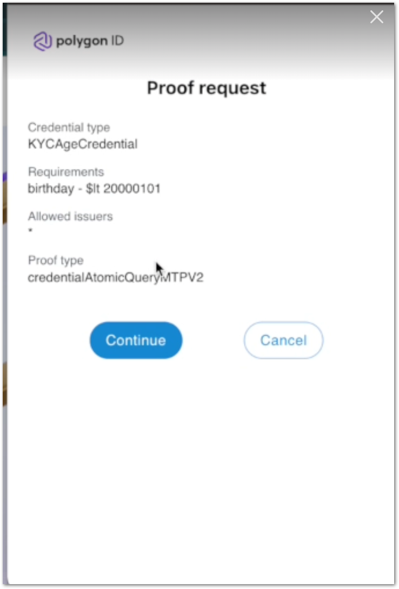
    

     
4. The website verifies your membership successfully.

    

    
    

     

5. On the Polygon Verify website, click **Auth Info** to view details of the ***Auth Request*** (authorization requested by the user). 

    Scroll down the page to view ***Auth Response***. here, you can see the proof, the public signals (used to generate the proof), and the JWZ token. Copy the JWZ token and paste it on the [Polygon ID JWZ Validator](https://jwz.polygonid.me) site. Click **Validate**. 

    Upon validation, the JWZ token is broken down into three parts: ***Header***, ***Payload***, and ***Auth Proof***.  

    

    
    

     

    

    
    

      

    

    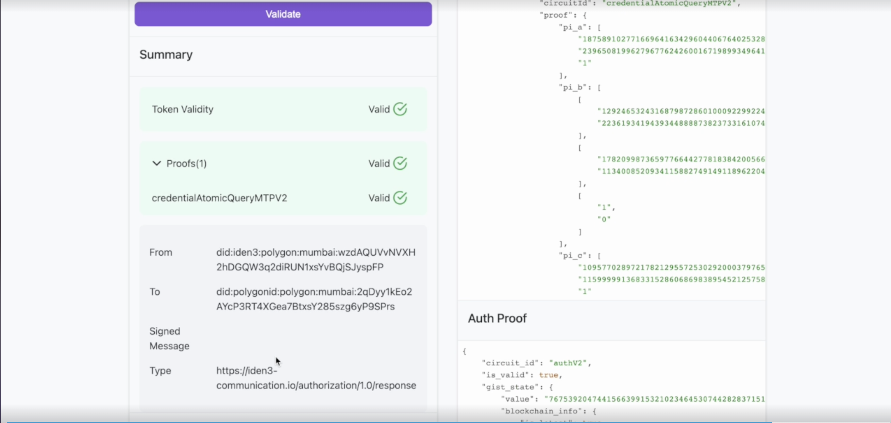
    

     

    You can see proof (***CredentialAtomicQueryMTPV2***) along with the other data including ***from*** and ***to*** fields. The ***from***  field stands for DID that sent the proof request. It must match your wallet's DID. The ***to*** stands for the Verifier DID to whom the proof request has been sent. 

6. Wait for the proof to get published on-chain. Post that, on the website, you can view the credential details that show ***state*** information such as ***txId*** (id of the transaction done from a wallet to complete publishing of the state on-chain), ***blockTimestamp*** (time at which block was created), ***blockNumber***, ***rootofRoots*** (Roots tree), ***claimsTreeRoot*** (Claims tree), ***revocationTreeRoot***(Revocation tree): 

    

    
    

    

    
    

    

    
    

     

7. Below the QR code, click the ***Polygon ID*** icon to open your browser wallet. On your wallet, click **Receive** to fetch and save the credential to your wallet. 

    

    
    

