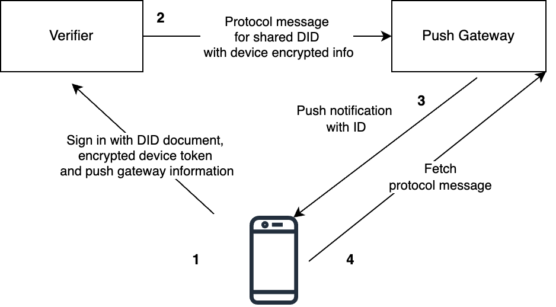

## Guide

Currently, to be able to implement push notification flow for certain app, this app must be registered in the push gateway config.  This can result as a centralization point for developers who wants to use such feature and some expenses and efforts on support of current gateway.

For Polygon ID wallet this push service is used: [http://push.polygonid.me](http://push.polygonid.me). 

Current notification flow: 



1. User creates a device push token. After the scanning the authorization request user must prepare an authorization response according to the current rules, but with an addition - inclusion of did document. 
DID document contains user  DID  and service to send push notification. User encrypts device push token with  Push Gateway public encryption key and embeds to DID document.
2. Verifier sending a message to  Push Gateway with information from the user did document.
3. Push Gateway decrypts push token stores messages, and sends push notification to the wallet. 
4. Wallet gets message with message ID and PPG URL. The application fetches notifications from the service, handles protocol messages, and asks the user if he wants to perform a needed action, e.g. fetch credential.

**Glossary:** 

- *wallet* - mobile application published by the Polygon.
- *verifier* - backend for polygon verify application that verifies user documents.
- *Push Gateway (PG)* - service to deliver push notifications to the wallet app.
- *Push notification* - notification that contains a link to protocol message or protocol message itself that is delivered through the notification provider.

# How to run a server

1. Go to the [link](https://github.com/iden3/notification-service)  and follow the instructions to run your own push notification service.
    1. For a Push Gateway service  sygnal is used. Sygnal can send notifications to Android and Apple devices. For Android devices, sygnal has integration with FCM for Apple devices sygnal has APNS integration. Also, we can add any other provider like SNS for this we must implement the next flow.
    2. Default algorithm for encryption is `RSA-OAEP-512`
2. Register your application on Firebase provider and update config.
3. Get public key of notification service for further encryption actions

# How to send an AuthorizationResponse from mobile with push information

1. Create a simple did document 

```json
{
  "@context": [
    "https://www.w3.org/ns/did/v1"
  ],
  "id": "did:polygonid:polygon:mumbai:2qDj9EDytmvtQP1or3FxykXGEaqSA1ss479MYHDMJc"
}
```

You can add information about keys / authentication info optionally. Follow this [specification](https://github.com/0xPolygonID/did-polygonid/blob/main/did-polygonid-method-draft.md) 

1. Create encrypted device information. 
Device information must be a valid JSON and encrypted with the public key of  Push Gateway.  Apply base64 encoding to encrypted byte array.
An encryption key must be used from notification service.

```json
{
  "app_id": "...",
  "pushkey": "push key",
}
```

1. Add push service for did document to service section
    
    ```json
    {
      "@context": [
        "https://www.w3.org/ns/did/v1",
        "https://schema.iden3.io/core/jsonld/auth.jsonld"
      ],
      "id": "did:polygonid:polygon:mumbai:2qDj9EDytmvtQP1or3FxykXGEaqSA1ss479MYHDMJc",
      "service": {
        "id": "did:polygonid:polygon:mumbai:2qDj9EDytmvtQP1or3FxykXGEaqSA1ss479MYHDMJc#push",
        "type": "push-notification",
        "serviceEndpoint": "https://push.polygonid.me",
        "metadata": {
          "devices": [
            {
              "ciphertext": "sIyhw8MsRzFTMXnPvvPnjpj38vVHK9z7w/DvHzX+i/68hSjWfSDjXUA49KopWexyoVsAhenS+AS7+JkatJ3+OTlNxUD+lFrAIJUE51qBiM7l7mmkAuryybUQmOgWJCbuUU2nsWFKzIvk2ZTxcMh5EoUxYV2/0HaTmYYTDkzCKQr/oVePlHbiKwG6XjjMCuNaooSAO7UlLduEZY9CjCWBahiJ7LPHq5+SMCSpA9DdxlYe5IDY7ZT0Yg8fmEAq5+ZGvPVDzk1SdXvZNtG/2yygb3ILrSHXN81ztJRPdsEjzctqWwIhP1zEncSMnNEY4vtxEc1red4PuNT6QX0EoP/aX4LdSGIgfM3KB6yjqKBOqgIGoTFih0h/YzcC42lv4oJw0t5obX+32FM8pzQBUoXMvV0F9WpNgDcN04F3/Su9GGRLFNLXApCtj2Mh4H0qnkjMzRMO42RTd3258HYH7U8xK48hpO0Wolt+rn3jrk/JXrVQqO/9EnhCu/PJL1+AoeVtTYL0zp57OWnIAXbW98MGg0pm0MpYwH51hmHx0YLH+4Fkqj30ydcZQhV3xtAVgvKfxQOwwNz2WhIefm+fwYLVAQB4SjUMOrRQYAos7PWgoc21I0QFu52dIA4IvYYBws2Vjb1LvssdFnrd4kUYbC7THdlWONfunbp9xgofzXTrj2g=",
              "alg": "RSA-OAEP-512"
            }
          ]
        }
      }
    }
    ```
    
2. Include did document as a `did_doc` field in the authorization response message [https://iden3-communication.io/authorization/1.0/response/](https://iden3-communication.io/authorization/1.0/response/)
3. Notification message format that is expected to be sent to mobile. Url field is a valid URL to fetch a message. Fetch request must be  a HTTP GET request with no authorization required. The message is available for 24 hours on Push gateway or deleted after the fetch request.

```json
{
  "id": "...",
  "url": "..."
}
```

# How to send a push from verifier

1. Parse a did document from authorization response
2. Proxy device info to push service using  serviceEndpoint using following format
    1. Message is protocol message that is meant to be delivered to users
    2. Devices is an object from push notification service from user did document
    
    ```json
    {
      "message": "JSON stringlied message",
      "metadata": {
        "devices": [
          {
            "ciphertext": "...",
            "alg": "..."
          }
        ]
      }
    }
    ```