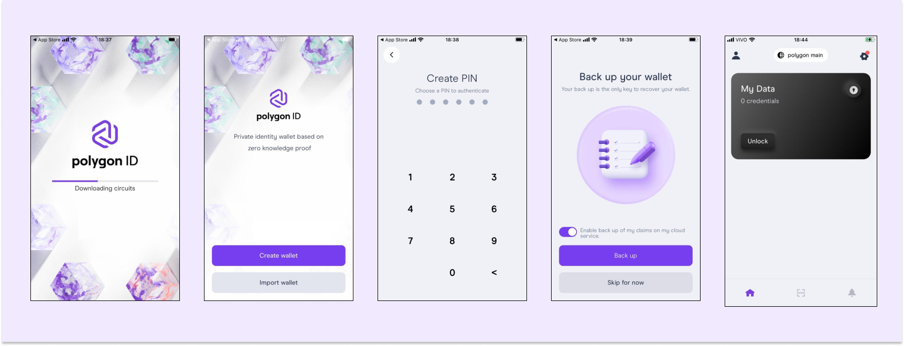

This tutorial is a quick demonstration of some of Polygon ID's main functionalities. To illustrate how Polygon ID works, we will walk you through some of its products and tools by following along a simple POAP use case.
POAP stands for Proof of Attendance Protocol, which is used to prove that someone has taken part in a given event.
 
This guide will briefly touch on the 3 roles of the [Triangle of Trust](index.md#core-concepts-of-polygon-id-verifiable-credentials-identity-holder-issuer-and-verifier-triangle-of-trust), namely the Identity Holder, the Issuer and the Verifier. For that, we will take the case of an individual who needs to prove that they were able to participate in a particular event.

These are the steps we will cover in this article:

1. [Set up a Polygon ID wallet](#set-up-a-polygon-id-wallet)
2. [Issue a new credential to attest to the ID Holder's attendance to the event](#issue-a-new-credential-to-attest-to-the-id-holders-age)
3. [Fetch the newly created credential](#fetch-the-newly-created-credential)
4. [Verify the credential validity](#verify-the-credential-validity)
5. [Query the ID holder for specific information of his credential](#query-the-id-holder-for-specific-information-of-his-credential)

## Set up a Polygon ID wallet
As an Identity Holder, the individual who wants to have a credential to prove his age, for example, will need an application that can hold their credentials. In our case, we will be using the Polygon ID Wallet. 

!!!note
    You can also use any Polygon ID compatible wallet. Please, check our [Ecosystem page](https://ecosystem.polygon.technology/PolygonID/) for other options.

To get started with the Polygon ID Wallet, download the Polygon ID Wallet App and create an Identity:

- For Android: <a href="https://play.google.com/store/apps/details?id=com.polygonid.wallet" target="_blank">Polygon ID on Google Play</a>
- For iOS: <a href="https://apps.apple.com/us/app/polygon-id/id1629870183" target="_blank">Polygon ID on the App Store</a>

!!!note
    Polygon ID wallet is an implementation of the Wallet SDK, as a way of showcasing its possibilities. Head to [the Polygon ID SDK documentation](./wallet/wallet-sdk/polygonid-sdk/polygonid-sdk-overview.md) to know more about how it works. 

The process from downloading to creating an identity on the Polygon ID Wallet is just as it is shown below. You need to download the app, create a wallet, set up a PIN number and the wallet is ready to be used. 

!!!warning
    This demo is using Polygon's Mumbai testnet. Go to the gear icon at the top right and ensure "Polygon Mumbai" is selected instead of "Polygon Main".
    

        </img>
    
   

## Issue a new credential to attest to the ID Holder's event attendance
A trusted entity, for instance, a private institution will now play the role of an issuer. It will be possible for creating the credential and send it to the ID Holder.
We are using a testing environment to manage credentials: [https://issuer-ui.polygonid.me](https://issuer-ui.polygonid.me). This is the place where the trusted entity can create credentials, schemas and generate connections. 
However, before you actually issue a credential using the Issuer node, you need to create a schema for that credential, which basically is the set of JSON files that gather all the attributes of that specific credential. 

!!!note
    To learn how to set up your own issuer environment by deploying an issuer node, visit the [Issuer section in the documentation](./issuer/issuer-overview.md).

### Create a schema

Here are the steps to generate a schema for a new credential type, in our case, a POAP credential: 

1. Head to the [Schema Builder](https://schema-builder.polygonid.me/).

    

        </img>
    
   

2. Let us define the schema in the following manner:

    - Title: POAPSchema
    - Schema type: POAP01
    - Version: 0.01
    - Description: This is a test POAP schema.

3. Click on **Add** and now you should be able to add attributes for this schema. Here's how you can fill up each of the fields:
    
    For the city attribute where the event will take place:

    - Name: city
    - Title: This is the POAP city
    - Data type: string
    - Description: schema desc
    
    Mark the **Required** checkbox. 

4. Publish it on IPFS, provided you already connected your MetaMask.

5. The resulting schema should look like this:

    

        </img>
    

    Copy the JSON Schema URL, as it will be used to import the schema later in this tutorial.

!!!info
    Learn more about creating new schemas on the [Schema Builder UI guide](./issuer/schema-builder.md) 

### Issue the credential
With the new schema in hand, the issuer should now be able to generate a credential.

1. First, go to the [Issuer Node UI testing environment](https://issuer-ui.polygonid.me).
    
    Provide the following login data:

    - user: `user-ui`
    - password: `password-ui`

    !!!warning
        This Issuer Node is publicly available and used only for testing purposes. Do not use personal or sensitive data. All data is deleted every 48 hours.

2. Now you need to import the schema. Click on **Import Schema** and paste the IPFS address generated in step 5 of [Create a Schema](#create-a-schema).

    

        </img>
    

    You may preview the schema and then Import it.

3. Access [https://issuer-ui.polygonid.me/credentials/issued](https://issuer-ui.polygonid.me/credentials/issued) and click on **Issue Credential**. Choose **Credential Link** on the next page and your schema on the dropdown menu ("POAP01", in our case). For this credential, we are providing a proof of attendance to an event in Paris:

    

        </img>
    

4. You can click on **View Link** on the next screen to check the generated QR code.

    

        </img>
    

## Fetch the newly created credential
Now we are back to the ID Holder role. They will use their mobile application to authenticate themselves by scanning the QR code generated by the issuer in the last step.

    </img>

Connect to the issuer:

    </img>

This will instantly trigger a notification on the mobile which will look like this:

    </img>

Accept the credential:

    </img>

The ID Holder successfully retrieved the credential and it is visible on the app: 

    </img>

## Verify the ID holder credential
Here comes the third role in this tutorial: the verifier. This could be represented by an organization that needs to check the accuracy of someone's credentials. In our use case, this organization wants to verify whether the ID holder actually attended our made-up Paris event.

Here are the steps to verify the credential:

1. Visit the [Verifier website](https://verifier-v2.polygonid.me/). As we are using a newly-created credential type, you need to choose **Custom** on the dropdown menu. Click on **Sign In**.

    

        </img>
    

2. Now you will make use of the JSON-LD Context URL that was generated on the same process when you created the JSON schema URL in step 5 of [Create a Schema](#create-a-schema). Here is how the query should look like:

    

        </img>
    

3. After clicking on **Submit**, you should scan the resulting QR code and follow the instructions on the mobile app.

    

        </img>
    

4. The process of generating the proof is then started:  

    

        </img>
    

5. And finally, the proof will be added to the Verifier environment.

!!!info
        This was a quick demonstration of Polygon ID's basic functionalities. However, Polygon ID is far more complex than this. It offers a range of SSI-focused tools that allow for decentralized identity and verifiable credentials management.  

