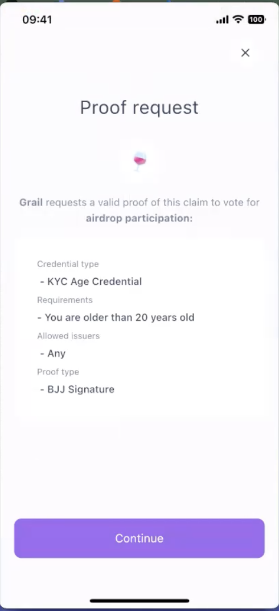

# On-chain zk verification

The on-chain verification allows Dapps to verify users' claim inside a Smart Contract. Zk enables this verification to happen in a privacy manner, namely without revealing any personal information of the user.

This flow is especially needed when further on-chain logic wants to be implemented on successful verification such as:

- Distribute a token-airdrop only to human-verified accounts
- Allow voting only to accounts member of your DAO 
- Block airdrops to users that belong to a specific country
- Allow trading only to accounts that passed the KYC verification

## Implement ERC20 zk airdrop in 20 minutes 

In this tutorial we are gonna create a ERC20 zk Airdrop Contract. The chosen verification criteria is to be born before the `01/01/2001`. Users that are able to prove that were born before that date will be able to get the airdrop. Otherwise, they will not. 

The prerequisite is that users have the Polygon ID Wallet app installed and received a claim of type `KYCAgeCredential` attesting their date of birth.

> The proof submitted to the smart contract will not reveal any information about the specific date of birth of the user. That's the zero knowledge magic! 

### Design the ERC20 zk Airdrop Verifier Contract 

Let's jump into the code by writing the `ERC20Verifier` contract. 

The ERC20Verifier is a ERC20 standard contracts on steroids. The extra functionality is given by the zero knowledge proof verification. All the functions dedicated to the zkp verification are contained inside the [ZKPVerifier Contract](https://github.com/iden3/contracts/blob/master/contracts/ZKPVerifier.sol#L50) and inherited within the ERC20Verifier. For example users will submit their proof to claim the airdrop by calling [`submitZKPResponse`](https://github.com/iden3/contracts/blob/master/contracts/ZKPVerifier.sol#L19).

The contract must define at least a single `TRANSFER_REQUEST_ID`. That is, the identifier of the request that the contract is posing to the user.

> In this specific case the request is: "to be born before the 01/01/2001". Note that this hasn't been added yet to the smart contract. It will be added in a few minutes!
```solidity
pragma solidity ^0.8.0;

import "@openzeppelin/contracts/token/ERC20/ERC20.sol";
import "@polygonIdlibrary/ZKPVerifier.sol

contract ERC20Verifier is ERC20, ZKPVerifier {

    uint64 public constant TRANSFER_REQUEST_ID = 1;
    // define the amount of token to be airdropped per user
    uint256 public TOKEN_AMOUNT_FOR_AIRDROP_PER_ID = 5 * 10**uint(decimals());


    constructor(string memory name_, string memory symbol_)
        ERC20(name_, symbol_)
    {}    

}
```

The [ZKPVerifier Contract](https://github.com/iden3/contracts/blob/master/contracts/ZKPVerifier.sol#L50) provides 2 hooks: [`_beforeProofSubmit`](https://github.com/iden3/contracts/blob/master/contracts/ZKPVerifier.sol#L94) and [`afterProofSubmit`](https://github.com/iden3/contracts/blob/master/contracts/ZKPVerifier.sol#L103). These hooks are called before and after any proof get submitted and can be used to create personalized logic inside your smart contract.

In this specific case it must be checked that the sender of the proof matches the address contained in the proof challenge. This requirement is necessary to prevent proof front-running. This condition is added inside `_beforeProofSubmit`.

The airdrop logic must be added inside `afterProofSubmit`. The contract must execute the airdrop once the proof is correctly verified.

```solidity
contract ERC20Verifier is ERC20, ZKPVerifier {
    uint64 public constant TRANSFER_REQUEST_ID = 1;

    mapping(uint256 => address) public idToAddress;
    mapping(address => uint256) public addressToId;

    uint256 public TOKEN_AMOUNT_FOR_AIRDROP_PER_ID = 5 * 10**uint(decimals());

    constructor(string memory name_, string memory symbol_)
        ERC20(name_, symbol_)
    {}

    function _beforeProofSubmit(
        uint64, /* requestId */
        uint256[] memory inputs,
        ICircuitValidator validator
    ) internal view override {
        // check that  challenge input is address of sender
        address addr = GenesisUtils.int256ToAddress(
            inputs[validator.getChallengeInputIndex()]
        );
        // this is linking between msg.sender and
        require(
            _msgSender() == addr,
            "address in proof is not a sender address"
        );
    }

    function _afterProofSubmit(
        uint64 requestId,
        uint256[] memory inputs,
        ICircuitValidator validator
    ) internal override {
        require(
            requestId == TRANSFER_REQUEST_ID && addressToId[_msgSender()] == 0,
            "proof can not be submitted more than once"
        );

        // address didn't get airdrop tokens
        uint256 id = inputs[validator.getChallengeInputIndex()];
        // additional check didn't get airdrop tokens before
        if (idToAddress[id] == address(0)) {
            super._mint(_msgSender(), TOKEN_AMOUNT_FOR_AIRDROP_PER_ID);
            addressToId[_msgSender()] = id;
            idToAddress[id] = _msgSender();
        }
    }
}
```

Finally, we can add a further element of security inside the smart contract: prevent any type of token transfer (even after the airdrop) unless users passed the proof verification. This last condition is added by overriding the ERC20 `_beforeTokenTransfer` function and checking that the receiver address `to` of the transfer is included inside the [`proofs`](https://github.com/iden3/contracts/blob/master/contracts/ZKPVerifier.sol#L12) mapping. 

```solidity
// SPDX-License-Identifier: MIT
contract ERC20Verifier is ERC20, ZKPVerifier {
    uint64 public constant TRANSFER_REQUEST_ID = 1;

    mapping(uint256 => address) public idToAddress;
    mapping(address => uint256) public addressToId;

    uint256 public TOKEN_AMOUNT_FOR_AIRDROP_PER_ID = 5 * 10**uint(decimals());

    constructor(string memory name_, string memory symbol_)
        ERC20(name_, symbol_)
    {}

    function _beforeProofSubmit(
        uint64, /* requestId */
        uint256[] memory inputs,
        ICircuitValidator validator
    ) internal view override {
       ...
    }

    function _afterProofSubmit(
        uint64 requestId,
        uint256[] memory inputs,
        ICircuitValidator validator
    ) internal override {
        ...
    }

    function _beforeTokenTransfer(
        address, /* from */
        address to,
        uint256 /* amount */
    ) internal view override {
        require(
            proofs[to][TRANSFER_REQUEST_ID] == true,
            "only identities who provided proof are allowed to receive tokens"
        );
    }
}
```

The contract is now fully written!

### Deploy the Contract  

Execute this Hardhat script to deploy the contract

```js

async function main() {
  const verifierContract ="ERC20Verifier"
  const verifierName = "ERC20zkAirdrop";
  const verifierSymbol = "zkERC20"; 
  const ERC20Verifier = await ethers.getContractFactory(verifierContract);
  const erc20Verifier = await ERC20Verifier.deploy(
    verifierName,
    verifierSymbol
  );

  await erc20Verifier.deployed();
  console.log(verifierName, " deployed to:", erc20Verifier.address);
}
```

> The contract ERC20Verifier must be deployed on Mumbai test network as there's a set of supporting contracts that are already deployed on Mumbai too! 

### Set the zkp request

As previously mentioned, the actual zkp request "to be born before the 01/01/2001" hasn't been added to the smart contract yet. To do so it is necessary to call [`setZKPRequest`](https://github.com/iden3/contracts/blob/master/contracts/ZKPVerifier.sol#L63). This function takes as input:
- `requestId`, namely the id associated to the request.
- `validator` the address of the [Validator Smart Contract](https://github.com/iden3/contracts/blob/master/contracts/validators/CredentialAtomicQuerySigValidator.sol). This is the contract that actually executed the zk verification. 
- `query`, namely the rules that the user must satisfy

Execute this Hardhat script to set the zk request to the smart contract.

```js
async function main() {

    const circuitId = "credentialAtomicQuerySig";
    const validatorAddress = "0x98ff8015A7E0f9646fBF9fF6225489c34c8E4F83";

    // To learn more about how to design query check https://0xpolygonid.github.io/tutorials/verifier/verification-library/zk-query-language/
    // To learn more about how the claim schema work check https://0xpolygonid.github.io/tutorials/getting-started/claim/claim-schema/
    const ageQuery = {
        schema: ethers.BigNumber.from("210459579859058135404770043788028292398"),
        slotIndex: 2,
        operator: 2,
        value: [20020101, ...new Array(63).fill(0).map(i => 0)],
        circuitId,
    };

    // add the address of the contract just deployed
    ERC20VerifierAddress = "0xB853a8779CD0751d276339618f6809Da6F033D93"

    let erc20Verifier = await hre.ethers.getContractAt("ERC20Verifier", ERC20VerifierAddress)

    const requestId = await erc20Verifier.TRANSFER_REQUEST_ID();

    try {
        await erc20Verifier.setZKPRequest(
        requestId,
        validatorAddress,
        ageQuery
        );
        console.log("Request set");
    } catch (e) {
        console.log("error: ", e);
    }
}
```

The contract is now correctly deployed on Mumbai Testnet and the query has been set up, congratulations! Now it is time to launch the airdrop! 

### Add the Proof request inside a QR code 

The last step is to design the proof request to be embedded inside a QR code. In this particular case this is how the request should look like:

```json
{
    "id": "c811849d-6bfb-4d85-936e-3d9759c7f105",
    "typ": "application/iden3comm-plain-json",
    "type": "https://iden3-communication.io/proofs/1.0/contract-invoke-request",
    "body": {
      "transcation_data": { 
                "contract_address": "0xB853a8779CD0751d276339618f6809Da6F033D93",
                "method_id":"b68967e2",
                "chain_id": 80001,  
                "network": "polygon-mumbai"
          },
      "reason": "airdrop participation", 
      "scope": [{
          "id": 1,    
          "circuit_id": "credentialAtomicQuerySig",
          "rules": {
            "query": {
              "allowed_issuers": [
                "*"
              ],
              "req": {
                "birthday": {
                  "$lt": 20000101
                }
              },
              "schema": {
                "url": "https://raw.githubusercontent.com/iden3/claim-schema-vocab/main/schemas/json-ld/kyc-v2.json-ld",
                "type": "KYCAgeCredential"
              }
            }
          }
        }]
    }
  }
```

> The scope section inside the json file must match the query previously set when calling the "setZKPRequest" function

Note that the request resembles in most of its part the one designed for [off-chain verification](https://0xpolygonid.github.io/tutorials/verifier/verification-library/request-api-guide/). The extra part that has been added here is the `transcation_data` that includes:

- `contract_address`, namely the address of the verifier contract, in this case ERC20Verifier
- `method_id`, namely that hash of the ABI of the [`submitZKPResponse`](https://github.com/iden3/contracts/blob/master/contracts/interfaces/IZKPVerifier.sol#L6) function
- `chain-id`, the ID of the chain where the smart contract has been deployed
- `network`, the name of the network where the smart contract has been deployed

> To display the QR code inside your frontend you can use the express.static built-in middleware function together with this [Static Folder](https://github.com/0xPolygonID/tutorial-examples/tree/main/verifier-integration/js/static)

Scanning the QR with their Polygon ID Wallet, users will be able to generate proofs and send transactions to the smart contract in order to claim their airdrop.

### Demo: Off-chain Verification for ERC-20 Token Transfer 

For this demo, we have used the [Verification Website](https://onchain.polygonid.me/), which is a zero-knowledge proof plugin for the ERC-20 tokens. Using this verifier site along with the PolygonID wallet app, you can use the ERC-20 standard for transferring tokens during an Airdrop event. For instance, your users are able to receive, say, 50 tokens by submitting the proof of their age (depending upon a pre-determined age requirement). Let us see the process in a step-by-step manner:

1. Open [Verification Website](https://onchain.polygonid.me/). Click **Participate in Airdrop**.

<div align="center">

</div>
<br>
 2. The verification site displays two QR codes:

 - For Signature Proof check (Off-chain verification)
 - For Merkle Tree Proof(MTP) check (On-chain verification is work-in-progress!!)


<div align="center">

</div>
<br>

3. Open PolygonID Wallet app and authenticate it with your pin/biometrics.

4. On the PolygonID Wallet app, click **Connect**. 

<div align="center">

</div>
<br>

5. With your mobile app, scan the QR code displayed on the Verifier site. 

<div align="center">

</div>
<br>

<div align="center">

</div>
<br>

**Data inside the QR Code**:  The scanned QR code has the following informtaion: 


```json
{
  "id": "c811849d-6bfb-4d85-936e-3d9759c7f105",
  "typ": "application/iden3comm-plain-json",
  "type": "https://iden3-communication.io/proofs/1.0/contract-invoke-request",
  "body": {
    "transcation_data": {
      "contract_address": "0xF66Bf7c7EAe2279385671261CAbCcf4d1D736405",
      "method_id": "b68967e2",
      "chain_id": 80001,
      "network": "polygon-mumbai"
    },
    "reason": "airdrop participation",
    "scope": [
      {
        "id": 1,
        "circuit_id": "credentialAtomicQuerySig",
        "rules": {
          "query": {
            "allowed_issuers": [
              "*"
            ],
            "req": {
              "birthday": {
                "$lt": 20020101
              }
            },
            "schema": {
              "url": "https://raw.githubusercontent.com/iden3/claim-schema-vocab/main/schemas/json-ld/kyc-v2.json-ld",
              "type": "KYCAgeCredential"
            }
          }
        }
      }
    ]
  }
}

```
<br>

where `transaction_data` consists of `contract_address`, `method_id`, `chain_id`, and `network` fields. For definition of these fields, please refer to [this](#add-the-proof-request-inside-a-qr-code) section of the document. 


**Note**: As the development on the on-chain verification takes the next steps, in future, contract address would no longer be part of the QR Code.


6. This displays the Proof Request page. This proof can be for a claim that the age of the token participant is above 22 years (or any other claim). In the screenshot below, the proof type is based on signature-based (based on Baby Jubjub key). Click **Continue**.

<div align="center">

</div>
<br>


7. The Cryptographic Proof page is displayed. As the proof is based on the proniciples of zero-knowledge, no private data of the user is shared except the proof that wallet sdk generates. Click **Generate Proof**. 

<div align="center">

</div>
<br>

8. User is prompted to authorize using pin/biometrics. 

<div align="center">

</div>
<br>

9. Upon succesful authorization, a wallet connect page is displayed that lets user select the wallet to be connected to the (Metamask is used in this demo) dapp.

<div align="center">

</div>
<br>

10. Click **Connect** to allow the dapp to connect to the MetaMask wallet account.

<div align="center">

</div>
<br>


11. The wallet sdk initiates the proof generation process. 

<div align="center">

</div>
<br>

12. For completing the proof generayion process, a small gas fee (in form of MATIC tokens)needs to be paid from the MetaMask Account connected to the dapp earlier. Click **Confirm**.

<div align="center">

</div>
<br>

13. The transfer is now complete and token particiapnt receives a pre-determined number of ERC-20 tokens in his/her wallet.

<div align="center">

</div>
<br>

#### Proof Submission 

The wallet sdk needs to call a `submitZKPResponse()`function before it can submit the proof for the requirements set in the Airdrop Participation process. This function forms part of the Zero Knowledge Proof Interface `IZKPVerifier`.

```solidity

import "./ICircuitValidator.sol";

interface IZKPVerifier {
    function submitZKPResponse(
        uint64 requestId,
        uint256[] memory inputs,
        uint256[2] memory a,
        uint256[2][2] memory b,
        uint256[2] memory c
    ) external returns (bool);
}

```
**Note**: As mentioned earlier in the tutorial, the `method_id` field in the QR code is formed by the hash of the function `submitZKPResponse` and its memory input parameters. 


### Extend to your own logic

Now that you have been able to create your first on-chain zk based application you can extend it to accomodate any type of imaginable logic. The target smart contract doesn't have to be an ERC20 but it can a ERC721, a DeFi pool, a voting smart contract or whatever contract you can think of. Equally the query can extended to any type of existing claim and based on the different operators available inside the [ZK Query Language](https://0xpolygonid.github.io/tutorials/verifier/verification-library/zk-query-language/). 

Another possibility to customize your Smart Contract involves setting different zk requests. First of all there need to be defined multiple `REQUEST_ID` inside the main smart contract. Therefore the contract deployer can set different query for each request ID and create different outcomes inside `_afterProofSubmit` according to the type of proof received. For example an airdrop contract can verify the role of a user inside a DAO and distribute a different amount of tokens based on the role.

### Resources

- ** Add link to a repo that contains all the code needed **

