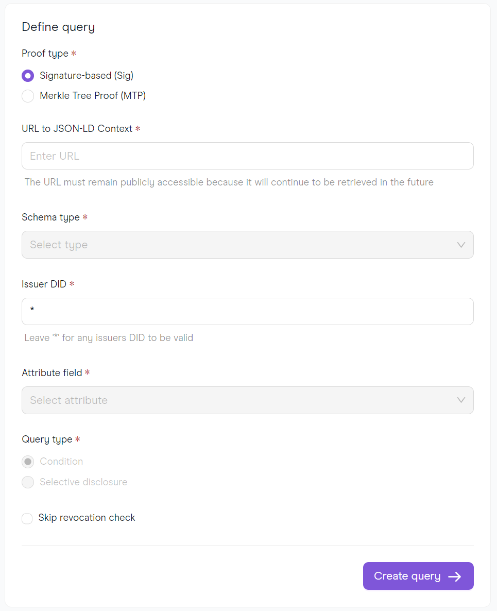
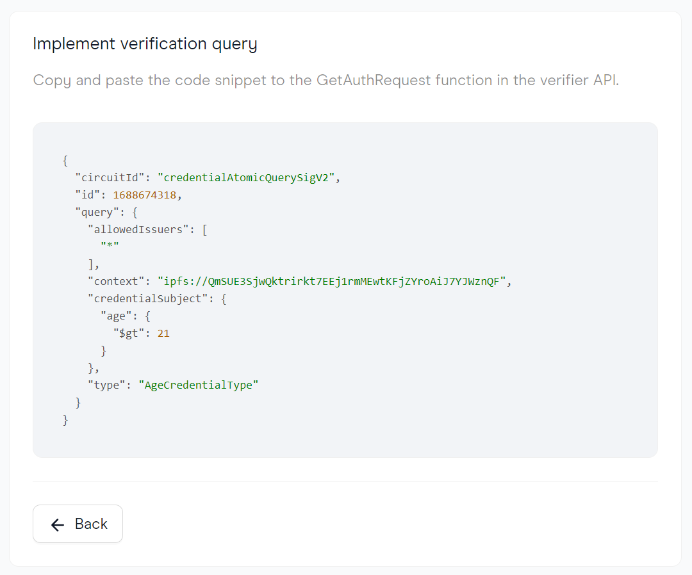

There is an interactive way of creating verification queries by utilizing an intuitive form with all the fields a comprehensive query must have. In Polygon ID, this useful feature is called [Query Builder](https://schema-builder-test.polygonid.me/query-builder).

Verifiers can create a set of rules that users need to meet to prove their identity using their existing credentials. These rules could range from being a member of a specific organization to being at a certain age. Polygon ID makes it easy and secure for users to prove their identity by using these rules for authentication purposes.

Currently, the only way to create a verification QR code - a way for users to scan and verify their credentials - is by using Request and Verification APIs.

By providing a standardized interface for query creation, a user interface can help ensure that queries are created in a consistent, uniform and error-free way across different users and organizations. Also, rather than requiring users to have knowledge of the query language, a user interface can provide a more intuitive and user-friendly way to create queries. 

{width="1000"}

The[Query Builder](https://schema-builder-test.polygonid.me/query-builder) contains the following fields:

- Proof type: credential issuance methods. SIG for Credentials with Baby JubJub(BJJ) Key Signatures and MTP for credentials with Merkle Tree Proof.
- URL to JSON-LD Context: this should be the address where the JSON-LD Context is stored, containing schema data.
- Schema Type: this is the field used to select the schema which the query is about, for credentials that have more than one schema type.
- Issuer DID: refers to the identification of the issuer that generated the credential. Use `*` to consider any issuers.
- Attribute field: this is the attribute the query is based on. For example, for a query requesting a user to be older than 21 years old, the attribute field should read "Age".
- Query type: the two options of queries that are available, a Condition or Selective disclosure. Condition depends on a value and an operator; that would be the case of a query requesting a user to be older than 21 years old. [Selective Disclosure](../verifier/features.md#selective-disclosure) is the feature used to ask the ID holder for a specific piece of their data.
- Operator: this is the relation between the attribute and the value. For example, for a query requesting a user to be older than 21 years old, the operator should read "More than".
- Value: this is the value the operator refers to. For example, for a query requesting a user to be older than 21 years old, the operator should read "21".
- Skip Revocation Check: will skip the check to see if a credential was revoked or not.

The [Query Builder](https://schema-builder-test.polygonid.me/query-builder) outcome should look like this: 

{width="1000"}

Then, one can copy and paste the snippet on the verifier API `GetAuthRequest()` function. 

!!!info
    The idea is to facilitate the query elaboration process by generating the whole section relative to "Request for specific proof" of the code, as it can be seen on the [Run a Verifier tutorial](../verifier/verification-library/verifier-set-up.md#verifier-server-setup), more specifically on point 3.
    
