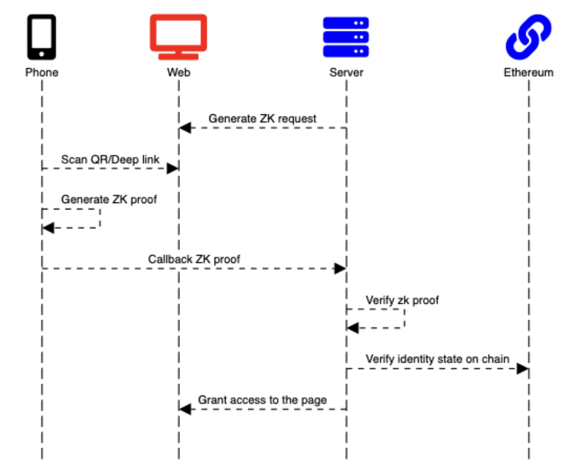

# Introduction

A Verifier is any Web2 or Web3 platform that wants to authenticate users based on their Polygon ID Credentials. Verifiers can set up queries based on **users’ existing credentials** collected from a broad set of issuers. A Query encapsulates the criteria that a user must match to authenticate, such as “must be a member of XYZ DAO” or “must be over 18 years old”. *Authenticate with Polygon ID* provides a seamless, customized and privacy-based authentication experience to users.

 
<b> Authenticate with Polygon ID workflow </b>

 

At its core, every interaction between a Verifier Platform and a User's Wallet follows this workflow:

- A Web application designs an authentication request to users that want to access the website. This is generated by the server and delivered to the user within a QR code (or via deep-linking, it is up to the implementer).
- The user scans the QR code using their mobile ID wallet and parse the request
- The user generates a ZK proof on mobile according to the request of the website starting from the credentials held in their wallet
- The user packs the response containing the proof into a JWZ (JSON Web Zero Knowledge) and sends it to the callback server
- The server verifies the ZK proof and, if verified, grants user access to the platform (or activates up any customized logic)

Assuming that the request is "are you over 18 years old?", the verifier *never gets access to any user's credential*. Instead, the verifiers receives a cryptographic proof which, on verification, provides an answer "yes" or "no" to the previous question. 

This section provides all the elements needed to integrate "Authentication with Polygon ID"

## Libraries

The authentication flow can be implemented either in GoLang or Javascript

- [Go Iden3 Authentication Library](https://github.com/iden3/go-iden3-auth)
- [JS Iden3 Authentication Library](https://github.com/iden3/js-iden3-auth)
