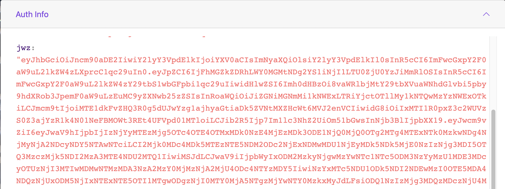

## Authenticate Identity with Issuer
 
An Integrator, to use the services of an Issuer, needs to authenticate itself with that Issuer. For this to happen, the Integrator needs to call the `authenticate()` function.
 
```
Future<void> authenticate(
      {required Iden3MessageEntity message,
      required String identifier,
      required String privateKey,
      String? pushToken}) {
    return _authenticateUseCase.execute(
        param: AuthenticateParam(
      message: message,
      identifier: identifier,
      privateKey: privateKey,
      pushToken: pushToken,
    ));
  }
```
 
As seen above, the `authenticate()` function uses the `identifier` and `private key` strings (returned from the `createIdentity()` function),the `Iden3 Message Entity` as the input parameters and the push token as optional for the integrator to be able to receive the iden3 messages through push notification.
 
### Wallet-Issuer Interaction using Authentication
 
An Integrator, to interact with an Issuer, needs to authenticate with it first. 
 
1.  On the Polygon ID app (which is based on SDK), an Integrator clicks **Connect**.
 
   <div align="center">
   
   </div>
 
   <br>
 
2.  The Issuer displays a QR code. The Integrator, using the app, scans this code.
 
   <div align="center">
   
   </div>
 
   <br>
 
 
3.  With this, the `Authenticate()` function (with the Identifier, private key and message as the inputs) is executed. The function authenticates the Identity and sends the authentication information (in the form of a big encoded message based on JWZ) to the Issuer.
 
   <div align="center">
   
   </div>
 
   <br>
 
**Note**: Read more on JWZ [here](https://github.com/0xPolygonID/tutorials/blob/main/mkdocs/docs/wallet/wallet-sdk-core-functionality/proof-generation/JWZ.md).
 
4. The Issuer receives the data sent by the Integrator and based on its correctness, authenticates or rejects the identity. The wallet analyzes this response from the Issuer.