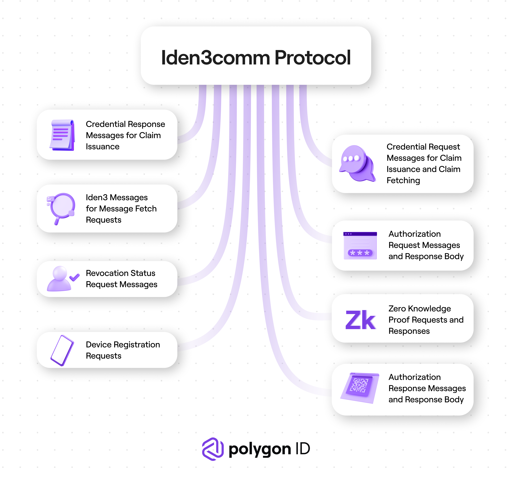

# Iden3comm Overview

Iden3comm is the protocol that defines the set of rules and syntax of the data that needs to be communicated while interacting with an Issuer and a Verifier. The protocol lays down the foundation for the semantics and the synchronization that is involved during the communication between two parties.   

The Iden3comm protocol defines the structure of the messages, requests, and responses that are quintessential for the exchange of information between the Identity Holder, the Issuer, and the Verifier. It handles the following types of messages, requests, and responses between the entities involved in the communication process:

- Authorization Request Messages and Response Body
- Authorization Response Messages and Response Body
- Zero-knowledge  Proof Requests and Responses
- Credential Request Messages for Claim Issuance and Claim Fetching
- Credential Response Messages for Claim Issuance
- Iden3 Messages for Message Fetch Requests
- Revocation Status Request Messages
- Device Registration Requests

For more details on the structure of each type of message, click <a href="https://github.com/iden3/iden3comm/tree/main/protocol" target="_blank">Iden3comm Protocol</a>.