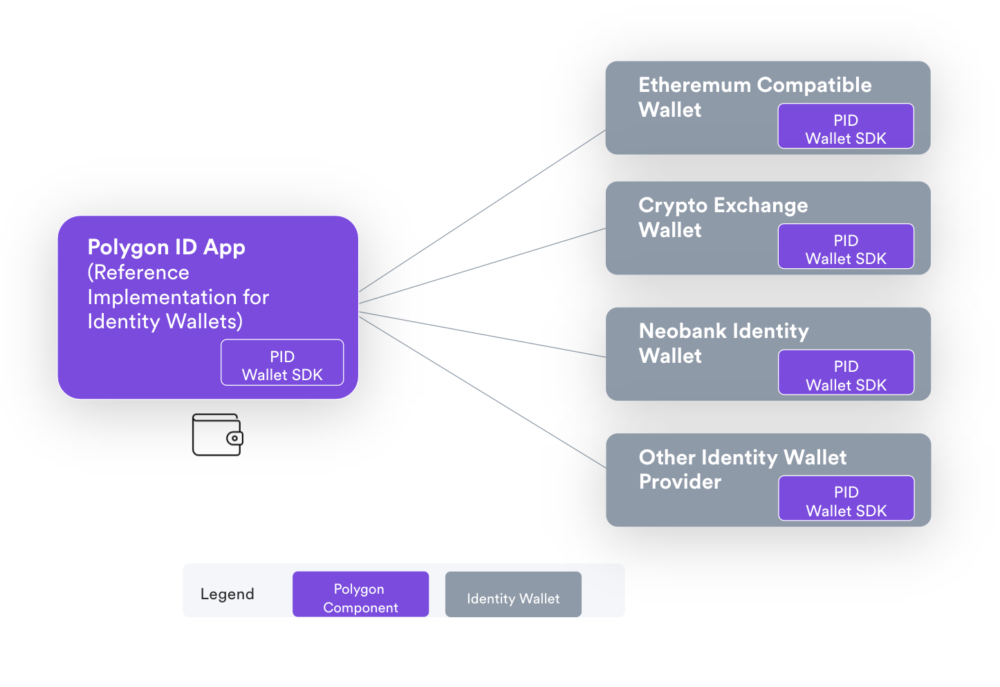

# Wallet Overview

A digital wallet is a software that can hold and manage users' `Credentials`. Based on the principles of Self-Sovereign Identity (SSI) and cryptography, a wallet helps its Holder share data with others without expositing any other sensitive private information stored on it. Only the wallet holder has the right to decide which information to share with other entities and what needs to remain private. 

The Polygon ID Wallet is a `Privacy by Default` wallet that helps protect a user's identity (and other metadata) by using zero-knowledge proofs. The wallet interacts with an Issuer to fetch credentials and with Verifier for sharing zkProofs based on these credentials.

The Polygon ID Wallet app is a reference implementation built using our Wallet SDK. Any other web3 wallets would be able to leverage the Wallet SDK to add the same functionalities. 

 

>**Note**: Currently, we support only mobile-based apps as wallets. The web-based applications and cold-storage wallets are not yet supported. 

>**Note**: Polygon ID Wallet is built using Flutter SDK. No other SDK is supported yet. 

## Features of the Polygon ID Wallet

The Polygon ID Wallet supports the following features:

- Privacy by design and Self-sovereignty: The user is in full control of his/her identity data and exchanges credentials with other identities without the need for an intermediary or centralized authority. 
- Open and Permissionless. 
- Fetching, storing, and managing credentials.
- Generating cost-optimized zero-knowledge proofs for credentials verification.
- Communication with Issuer and Verifier.
- Identity recovery using seed phrase.

 

> Download links for the PolygonID Wallet App:
> - For Android: <a href="https://play.google.com/store/apps/details?id=com.polygonid.wallet" target="_blank">Polygon ID on Google Play</a>
> - For iOS: <a href="https://apps.apple.com/us/app/polygon-id/id1629870183" target="_blank">Polygon ID on the App Store</a>

 

It is worth noticing that, in order to comply with the principles of the Self-Sovereign Identity (SSI), all the credentials are stored only locally on your wallet and are not stored on-chain; this ensures strong privacy for the sensitive data related to your credential(s). 
 

## How is Polygon ID Wallet Different from Other Wallets?

You, at some point in time, must have used cryptographic wallets such as Metamask, Trust Wallet, Coinbase Wallet, Ledger, and so many more. How is Polygon ID Wallet different from all these hot and cold storage wallets? Let us see:

- The wallets like Metamask and Trust Wallet are used for sending and receiving crypto transactions on-chain. Polygon ID Wallet, on the other hand, is used for creating and storing unique identities for the wallet so that these identities can be used to authenticate with the Issuer and the Verifier. This Identity wallet helps an Integrator fetch and save credentials from Issuers and also present proof of these credentials to the Verifiers. 

- While the commonly-used crypto wallets let you interact with Ethereum and other blockchain networks using RPCs (Remote Procedure Calls), this is not the case with Polygon ID Wallet - it functions solely to store credentials linked to an identity and lets these credentials get verified by creating zero-knowledge proofs. 

- General wallets store cryptographic keys while the Polygon ID Wallet stores users' identities. While both types of wallets are based on private-public key cryptography, the two are different in the sense that in a wallet like MetaMask, the elliptic curve used is `secp256k1`, which is used to convert a private key to a public key and eventually to an Ethereum Address, which identifies your wallet. On the other hand, Polygon ID Wallet is based on the `Baby Jubjub Key` which generates Polygon Id Identifier, which is the identifier for your wallet instead of the Ethereum Wallet Address. 

## Polygon ID Wallet SDK

The Polygon ID Wallet is built (this is, currently, under development) using Flutter SDK. We refer to this SDK as `Polygon ID Wallet SDK`. An Integrator can use this Polygon ID Wallet SDK to either create their own apps (that provide similar functionality as that of the Polygon ID Wallet App) or integrate the functionalities seamlessly with their existing apps. 

### Why Polygon ID Wallet SDK?

Integrating your app with Polygon ID Wallet SDK can provide you with the major features of an SSI system. As it is built on zero-knowledge protocol, it can let you create an identity application that is not only robust but also maintains high standards of privacy for your users, thus letting them protect their sensitive data from the third-party while revealing only the required information. The Polygon ID Wallet SDK lets you:

- Create an Identity for a wallet
- Remove and restore identities from a wallet.
- Authenticate your wallet with an Issuer/Verifier.
- Receive credentials from an Issuer and store them on the wallet.
- Update credentials and remove them from the wallet when required.
- Generate zero-knowledge proof that can be sent to a Verifier for verification. 

