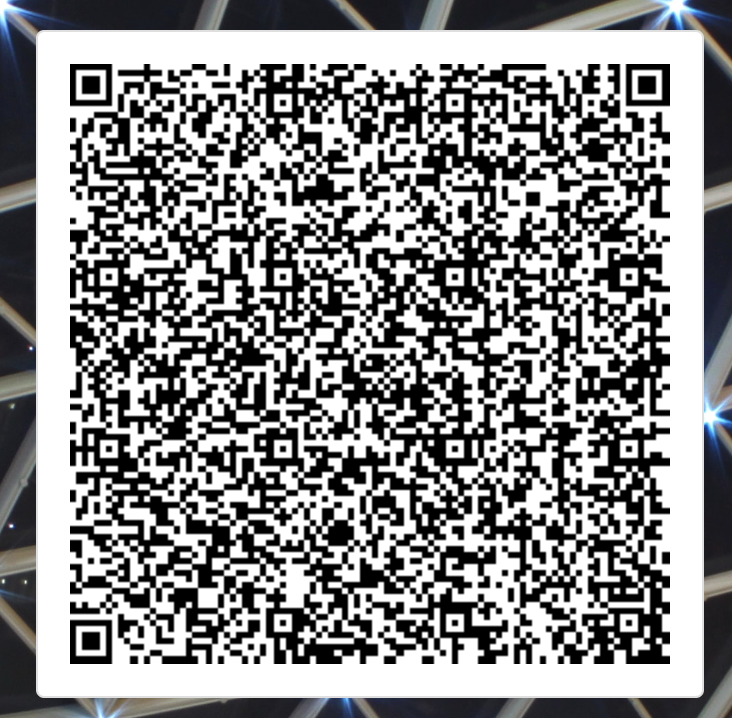
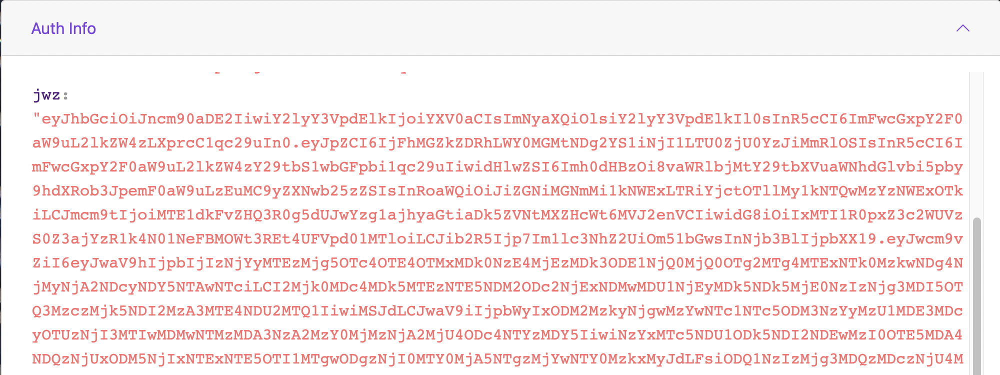

# Sign and Authenticate 

An Identity needs to authenticate itself and also authenticate with the Issuer. To achieve this, `sign()` and `authenticate()`(currently called `getAuthToken()`) functions are used. Let us understand these in detail in the following paragraphs.

## Sign the Message

You read in the [create-identity.md](./wallet/wallet-sdk-core-functionality/identity-wallet/create-identity.md) tutorial that the `createIdentity()` function returns an `identifier` string. Along with this `identifier` string, an identity needs to sign a `message` string. The `sign()` function takes both these strings as input parameters and generates another string representing signature of the identity:

```
Future<String> sign(
      {required String identifier, required String message}) async 

        {
            return _signMessageUseCase.execute(
            param: SignMessageParam(identifier, message));

        }
```    
## Authenticate Identity with Issuer

An Integrator, in order to use the services of an Issuer, needs to authenticate itself with that Issuer. For this to happen, the Integrator needs to call the `Authenticate()` function. 

```
Future<String> getAuthToken(
      {required String identifier,
      required CircuitDataEntity circuitData,
      required String message}) 
      
       {

            return _getAuthTokenUseCase.execute(
            param: GetAuthTokenParam(identifier, circuitData, message));

        }
```

As seen above, the `Authenticate()` function uses the `Identifier` string (returned from the `createIdentity()` function), the `circuitData` string (type of circuit used and other data), and the `message` string as the input parameters and returns a big encoded String (based on the JWZ or JSON Web Zero Knowledge standard). 

### Wallet-Issuer Interaction using Authentication

An Integrator, in order to interact with an Issuer, needs to authenticate with it first. For Polygon ID, we use `Polygon.Verify` as the Issuer. 

1.  On the Polygon ID app (which is based on SDK), an Integrator clicks **Connect**. 

    <div align="center">
    
    </div>

    <br>

2.  The Issuer (`Polygon.Verify` website) displays a QR code. The Integrator, using the app, scans this code.

    <div align="center">
    
    </div>

    <br>


3.  With this, the `Authenticate()` function (with the Identifier, circuitData and message as the inputs) is executed. The function authenticates the Identity and sends the authentication information (in the form of a big encoded message based on JWZ) to the Issuer.

    <div align="center">
    
    </div>

    <br>

**Note**: Read more on JWZ [here](https://github.com/0xPolygonID/tutorials/blob/main/mkdocs/docs/wallet/wallet-sdk-core-functionality/proof-generation/JWZ.md).

4. The Issuer receives the data sent by the Integrator and based on its correctness, authenticates or rejects the identity. The SDK analyzes this response from the Issuer. 


